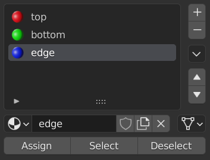
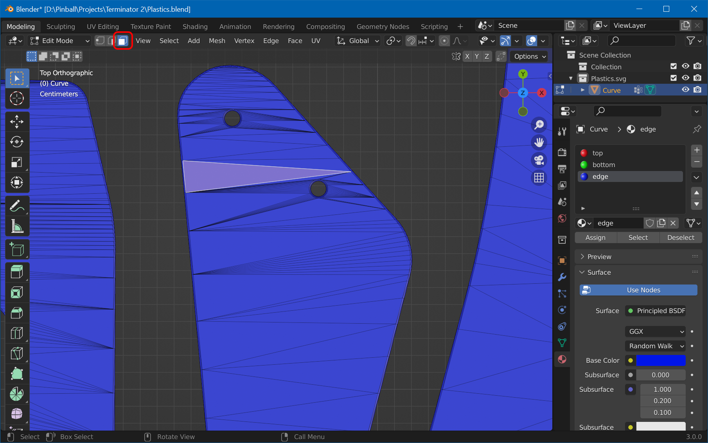
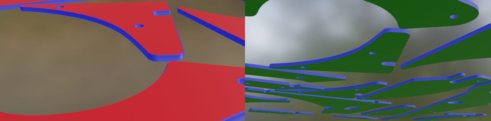
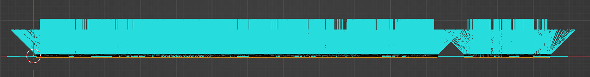
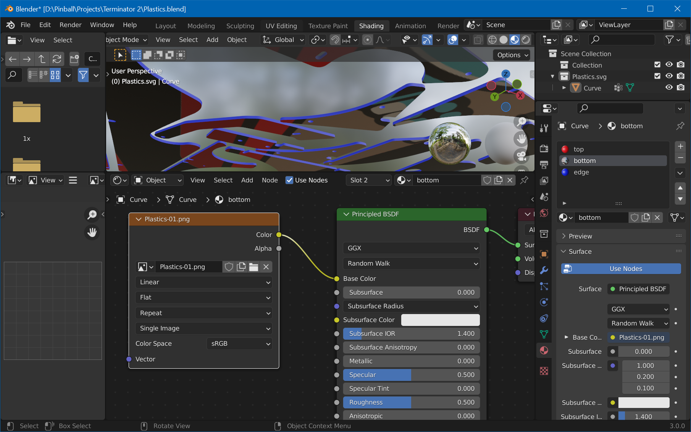

# UV-Map Mesh

## Step 1: Create Material Slots

 We need three material slots, for the top and bottom faces, as well as for the edges. We'll split the vertices by firstly assigning everything to an "edge" slot, and the re-assigning the top and bottom faces to their own slots.

In object mode, open *Materials* properties and remove the current material slot (hit `-`). Add three new slots, name them "top", "bottom" and "edge". For each slot, create a new material by hitting the *New* button when the slot is selected, and set their base color to red, green and blue respectively. Your slots should now look like in the screenshot.

Set the 3D viewport to *Material Preview*. Select your mesh, press `Tab` to switch to edit mode. Press `A` to select all vertices, select the "edge" material slot, and hit *Assign*.

Then, press `7` on the numpad to switch to top view, zoom in a bit so you can clearly see the triangles, switch to *Face Select* and click on one face of the top surface:

Click on *Select -> Select Similar -> Coplanar*, which should result in all top faces of all plastics being selected. Then, select the "top" material slot and hit *Assign*.

For the bottom faces, hit `7`, `9` on the numpad to switch to bottom view, and select again one face. Like before, select all coplanar triangles, then the "bottom" material slot, and *Assign*. You should see the bottom faces turn green.

Now, the "edges" material slot should only contain the edges. Check by unselecting all (`A` `A`), then selecting the "edge" material slot and hitting *Select*. This should only select the edges, like here:

In *Material Preview* mode, your meshes should now be colored like this (from top / bottom):

## Step 2: Flip Normals

Since the texture of the bottom points upwards into the mesh, we need to flip normals of the bottom triangles. In edit mode, unselect all, click on the "bottom" material slot and hit *Select*. Then, click on *Mesh -> Normals -> Flip*. When enabling normals visualization in the 3D viewport, it should now look like this:

The thing to note is that no normals should be pointing down.

## Step 4: UV-Map

First, we need to assign the texture. Switch to the *Shading* workspace and select the "bottom" material. In the shader editor, click on *Add -> Texture -> Image Texture*. Select the exported `Plastic-01.png` you've created in part one. Link it up to the *Base Color* of the BSDF node:

Now we can UV-map the texture. Switch to the *UV Editing* workspace. 

