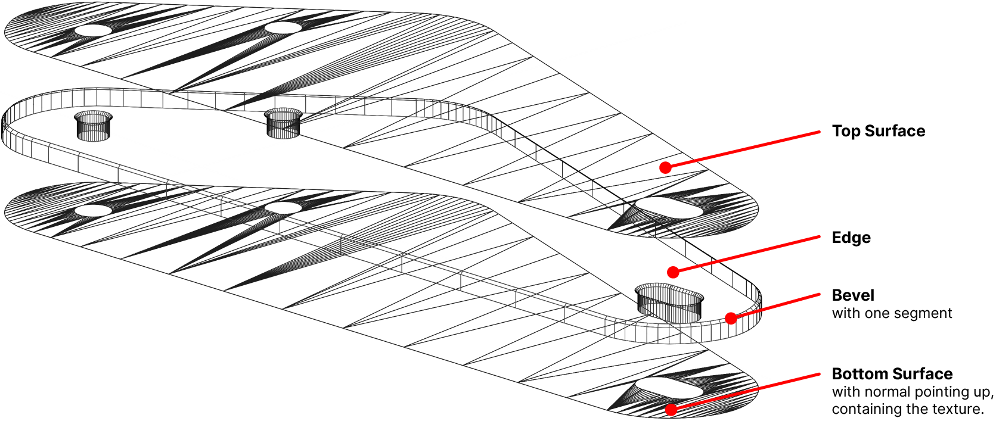

# Create Realistic Looking Plastics

This tutorial runs through a workflow that has been working well for us, from exporting the art and surfaces from a vector graphics program like Adobe Illustrator, through creating the mesh in Blender, to importing it into Unity setting up the correct materials.

For mesh creation, we'll use vector outlines that are part of the plastics artwork. This allows us to precisely align the artwork to the future mesh.

## Overview

The result of this workflow is a set of GameObjects in Unity with the typical plastic look. For that, our meshes consist of three pieces, each assigned to a material slot:

- The top surface, acting as the semi-transparent plastic.
- The side faces that include a simple bevel. This is where we add the refraction effect.
- The bottom surface, with the normals pointing up. This is where the texture is mapped to.

Every plastic will have its own GameObject. However, only one texture is shared between all the plastics.

<small><i>The final result!</i></small>

## Prerequisites

- While we provide some guidelines for the artwork, we won't go into detail how to produce it. So we assume that you have your artwork ready.
- You should be familiar with a vector graphics software such as Adobe Illustrator. 
- You should know your way around in Blender. Beginner level is fine, but you should be able to navigate in the viewport, know what UV-mapping is and know the basics about modifiers.

## Workflow

1. [Prepare Artwork](xref:plastics_with_blender_1)
2. [Create mesh in Blender](xref:plastics_with_blender_2)
3. [UV-map texture in Blender](xref:plastics_with_blender_3)
4. [Import mesh into Unity](xref:plastics_with_blender_4)

## Alternative Workflow with Houdini

If you're familiar with Houdini, you might be interested in replacing Blender with Houdini. The problem with Blender is that it's a destructive workflow, i.e. if you have to change the outlines from which the mesh is generated from, you'll need to redo steps two and three.

Houdini however is completely non-destructive, so here's a workflow that allows you to quickly regenerate meshes in case you need make changes when placing them on the playfield.