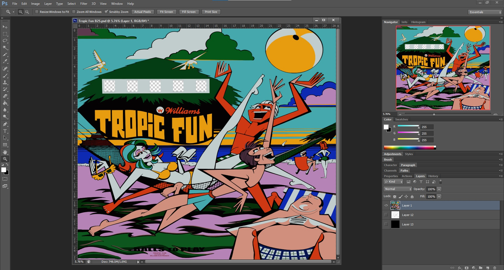
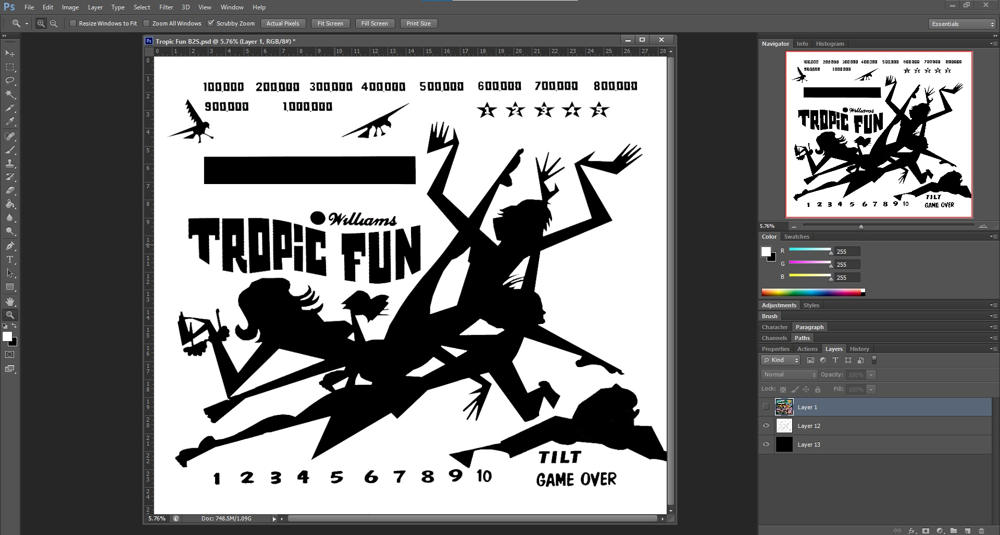

# Finding Artwork

Perhaps the most challenging aspect to making a working backglass is finding good artwork.  The best possible art is a direct scan of the backglass but that is not always possible.  There are backglass images that can be found online but it takes a fair amount of time to clean these up and remove any artifact from them.

# Editing the Color Layer

Once you have your artwork secured save the color layer as a png file with the areas for the score reels and credit reel set as transparent.  Be sure to size the backglass image to the size of the original backlgass.

# Editing the Thickness Mask layer

To block the passage of light through the backglass we need to make a thickness map layer.  This layer consists of pure white (255,255,255) for the areas that are opaque and pure black (0,0,0) for the areas that are transparent.  If you have a scan of the backglass this is easy to set up.  If you don't have a scan then you'll have to find a font that matches the original and layout all of the mask artwork.  Once you are done, save this as a png as well

You're now ready to [create the meshes](xref:tutorial_backglass_2).
