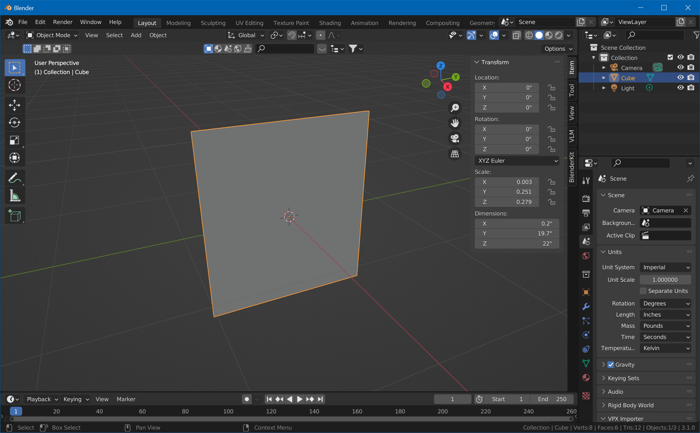
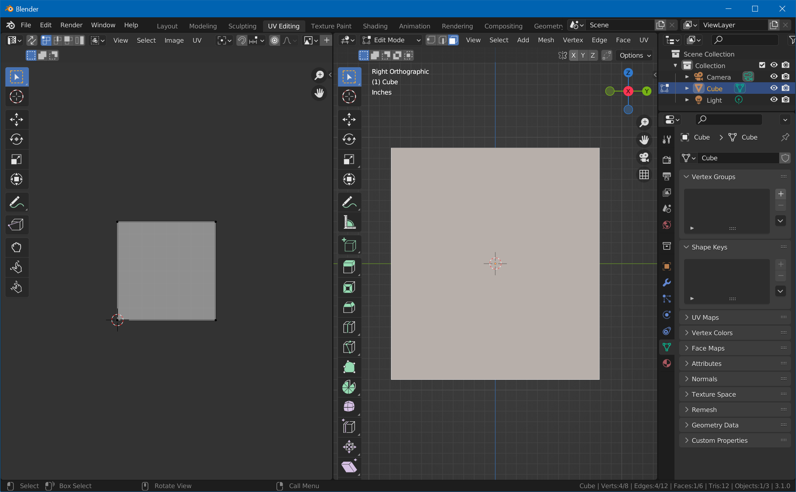

# Create a Backglass Mesh

We're now going to edit Blender's *default cube* and unwrap it to fit the backglass artwork. Note: this might be the only tutorial on the internet that actually uses the default cube ;)

## Create the Geometry

Open Blender and select the default cube. In the *Scene Properties* window, set units to *Imperial* and the length to *Inches*. With your mouse cursor over 3D viewport, hit `N` to show the transform properties of the cube. Enter the dimensions of your backglass in the `Y` and `Z` fields under *Dimensions*. The `X` value isn't really important, make it something small like 0.2".

Then, while the object is still selected, hit `CTRL+A` and choose *Scale* to apply the scale to the geometry.

## Unwrap the Front Surface

The edges and the back side of the translite won't be visible, so we'll only unwrap the front side. Since the aspect ratio of the front side matches the aspect ratio of our maps, we can to project it entirely onto the map.

Change to the *UV Editing* workspace. Put your mouse cursor over the right window and press `numpad 3` to switch to an orthographic front view of the backglass. Make sure you're in edit mode, hit `3` for face selection and click on the front face. Select *UV -> Project From View (Bounds)*. 

In order to clear the unused faces, hit `CTRL+I`, hover over the left side, hit `1` for point selection,  type `S` for scale, and enter `0`.

## Clean Up and Export

Go back to the *Layout* workspace. Select *Material Properties*, click on *Material* and on the `-` button to remove it. Hit `F2` and rename the `Cube` to `Backglass`.

Then, with the object still selected, choose *File -> Export -> FBX*. Check *Selected Objects* only, and name it `Backglass.fbx`.

You're now ready to [import into Unity](xref:tutorial_backglass_3).
