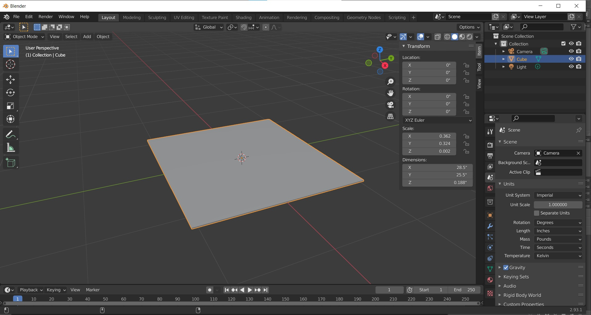
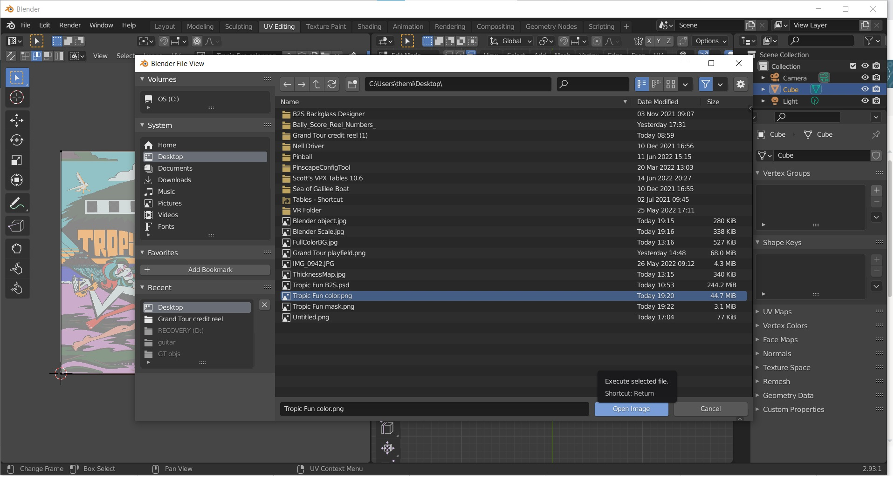
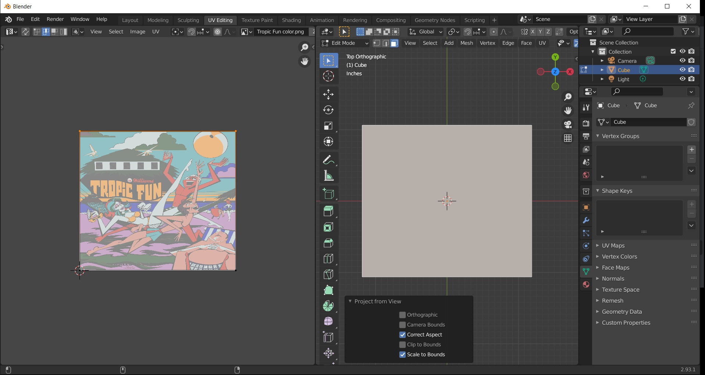
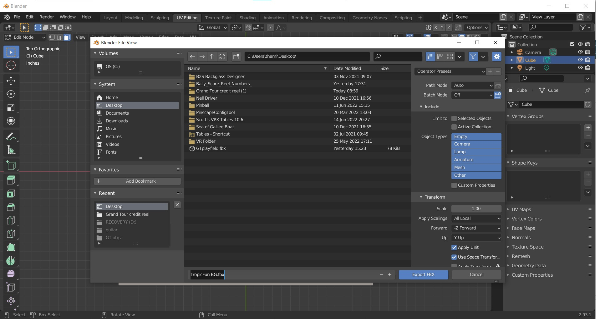

# Create a Backglass Mesh

We're now going to edit the _default cube_ and unwrap it to fit the backglass artwork.  _Note: this might be the only tutorial on the internet that actually uses the default cube ;)_

## Step 1: Edit the Cube

Open Blender, choose *File -> New -> General* and select the _default cube_ that is native to this scene while in Object Mode.  Under the Scene setting in the lower right change the units to *Imperial* and set the length to *Inches*.  At the upper right of the window pull out the menu there and type in the exact dimensions of your backglass.

## Step 2: Scale the Backglass

Once you've set the dimensions of the backglass zoom in on it and while still in *Object Mode* select *Object -> Apply -> Scale*.  This will set the scale to 1:1:1 which will lock in your edit of the backglass.

## Step 3: Import the artwork

To start the process of unwrapping the object that we just made we first must bring in the artwork that we created in the previous step.  To do that select "UV Editing" and in the left screen choose *Image -> Open* and navigate to the Color Artwork that you made in Step 1.

## Step 4: Unwrap the Front surface

To be able to use the object that you've just created, we'll create a UV map for it. For this to work, we only need to unwrap the front face of the backglass and make sure that it fits the artwork.

Change to the *UV Editing* workspace. Put your mouse cursor over the right window and press `numpad 7` to switch to an orthographic top-down view of the backglass and `numpad 5` to get a view from the top.  Hit `3` for face selection and click on the front face. In the right window, choose *UV -> Project From View (Bounds)*.  

You should see an unwrapped face appear in the left window that lines up with the artwork that you made.  If the edges don't line up, hit `2` for edge selection in the left screen, click on the edge that needs to be moved and hit `G` while hovering over that edge.  This will select the edge and allow you to move it to the correct location. Note that you do not need to "click" to move the edge.

## Step 5: Export from Blender

The hard work is now done!  Choose File/Export and save the file as an fbx.

You're now ready to [import into Unity](xref:tutorial_backglass_3).
