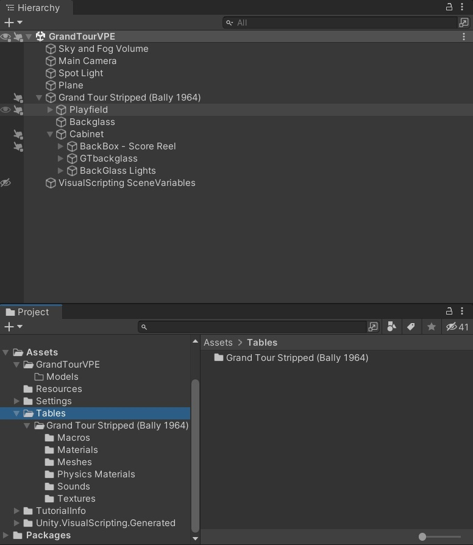
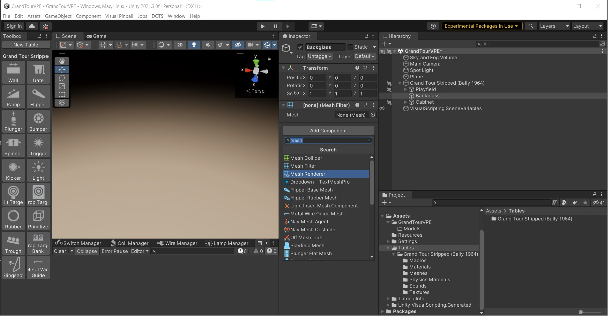
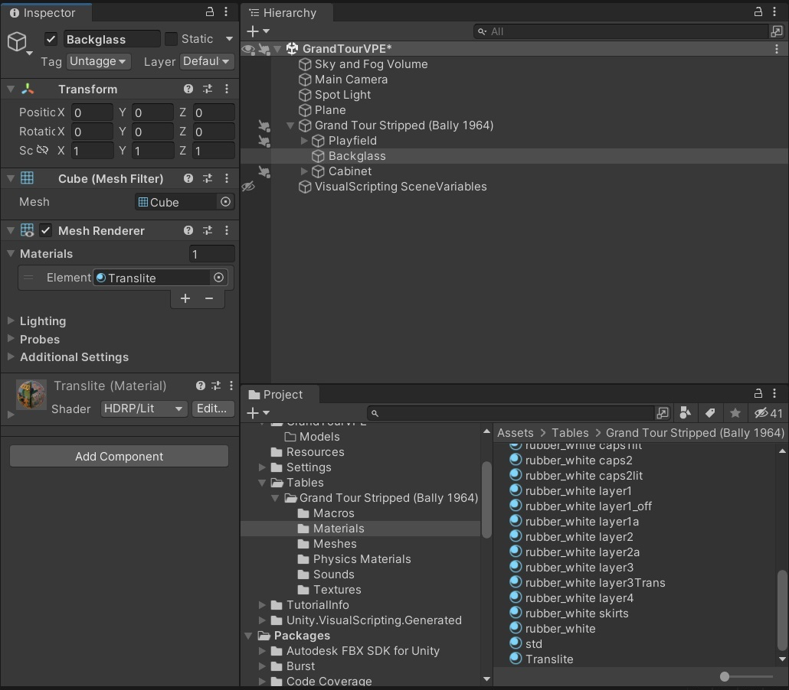
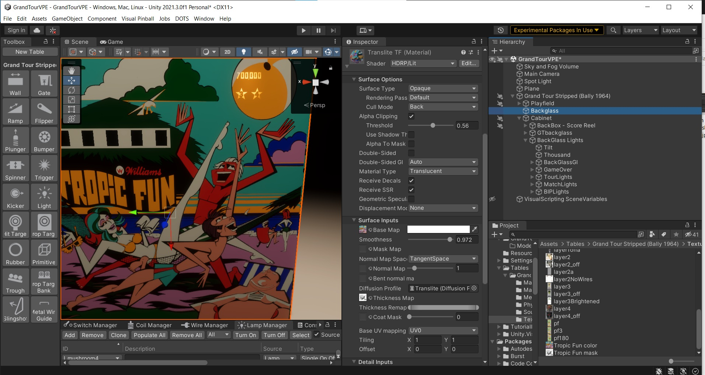

# Import Into Unity

## Step 1: Import the FBX

Open your scene in Unity and navigate to where your table stores its Materials, Meshes and textures.  Drag and drop your backglass mesh into "Meshes" and your images into "Textures"

> [!note]
> We recommend storing models at `Assets/<Table Name>/Models`, and texture at `Assets/<Table Name>/Textures`. In this example the Tropic Fun backglass is being created in another table for demonstrative purposes.

## Step 2: Add a Mesh Filter

In the Hierarchy window add a new element by right clicking and choosing "create empty". In this case we named it "Backglass".  Right click in the "Inspector" window and search for "Mesh Filter" and add this to the inspector window.  With the Mesh Filter highlighted search for the Blender backglass mesh that you made.  Grab the "cube" mesh from this and drag-drop it into the "mesh" slot in the mesh filter.   If the cube cannot be moved, select the top level (in this case TropicFun BG), right click and select "unpack".

## Step 2: Add a Mesh Renderer

Next right click in the "Inspector" window, search for "Mesh Renderer" and add this to the inspector window.

## Step 4: Add a Translite Material

Navigate to the "Translite" material and drag and drop this into the "Materials Element" box of the Mesh Renderer.

## Step 5: Set up the Masks

Under the Surface Inputs of the Translite material drag and drop the color backglass png into the "Base Map" slot and the black & white thickness map png into the "Thickness Map" slot.

## Step 6: Hooray You are Done!

Congratulations!  You have now made a backglass that will transmit light through the color overlay and block light in any of the masked area.  You can test it out by putting a light source behind the backglass and move it around.

If you came across an error or have a better way of achieving this, don't hesitate to click on the *Improve this Doc* button on the top right side ([documentation](https://github.com/freezy/VisualPinball.Engine/wiki/Documentation)).
