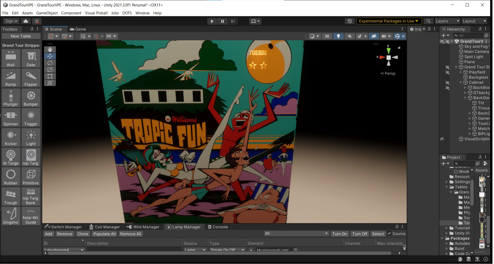

# Create a Backglass

This tutorial runs through the workflow for making the color and mask artwork, creating a mesh in Blender and importing that mesh and artwork up in Unity to create a working backglass.

## Overview

The result of this workflow is a pinball backglass that is properly sized and contains color artwork along with a light blocking thickness map:

<small><i>The final result!</i></small>

## Prerequisites

- While we provide some guidelines for the artwork, we won't go into detail how to produce it. So, we assume that you have your artwork ready.
- You should know your way around in Blender. This tutorial will show how to size and unwrap the mesh for import into Unity.

## Workflow

1. [Prepare Artwork](xref:tutorial_backglass_1)
2. [Create mesh in Blender](xref:tutorial_backglass_2)
3. [Import mesh into Unity](xref:tutorial_backglass_3)
