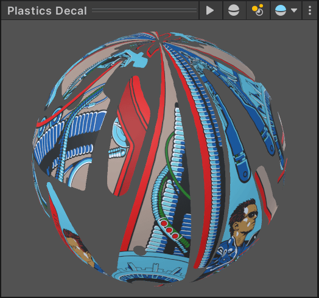
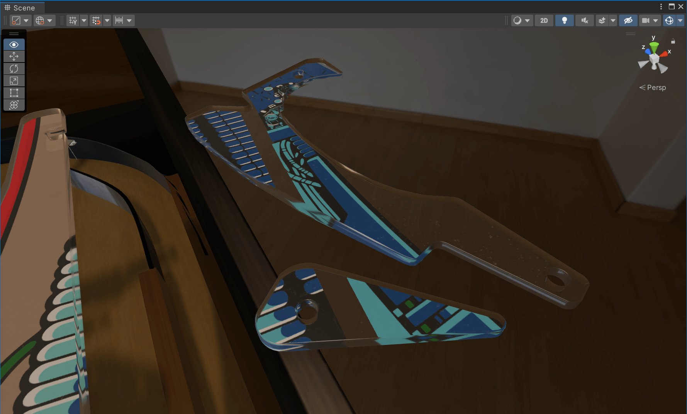

# Import Into Unity

## Step 1: Import the FBX

Open your scene in Unity and use the *Project* window to navigate to where you've exported your FBX.

> [!note]
> We recommend storing models at `Assets/<Table Name>/Models`, and texture at `Assets/<Table Name>/Textures`. If you haven't already, copy `Plastics-01.png` as `Plastics.png` and `Plastics.fbx` into the corresponding folders.

Drag `Plastics.fbx` under the `Playfield` GameObject. Scale and rotate them until they have the approximate size.

We recommend unpacking the prefab. Unpacking will still reference the meshes of your FBX, but not the position *within* the FBX. That way you're more flexible in positioning the plastics, and should you move them in Blender later you won't need to re-position them in Unity. In order to do that, right-click on the `Plastics` GameObject and select *Prefab -> Unpack*.

## Step 2: Setup Assets

First, let's configure how the texture is imported. In the *Project* window, navigate to `Assets/<Table Name>/Textures` where you saved `Plastics.png`, and select it. In the *Inspector* window, check the option *Alpha Is Transparent*. Depending on how large you've exported it, you might need to update *Max Size* as well, in our case we'll use 4096 × 4096. When you're done, hit *Apply* at the bottom.

Next, we'll create a material of our bottom surface. In the *Project* window, navigate to `Packages/Visual Pinball Engine (HDRP)/Assets/Art/Materials/Default/Plastic`, select `Plastics Decal`, hit `Ctrl`+`C`. Navigate to your project's `Assets/<Table Name>/Materials` folder, and press `Ctrl`+`V`.

Select the copied `Plastics Decal`. In the inspector, under *Surface Inputs*, click on the little circle next to *Base Map*, and type "Plastics" in the search box. Select the imported texture you've created and close the picker dialog.

## Step 3: Assign the Materials

Now we have our materials ready, let's assign them to our plastics.

Select all plastics GameObjects. In the inspector, under *Mesh Renderer -> Materials*, you should see three empty elements. These are our material slots. Drag the `Plastics Decal` material you've just updated into the last slot (Element 2). 

Then, in the *Project* window, navigate to where you were before, to `Packages/Visual Pinball Engine (HDRP)/Assets/Art/Materials/Default/Plastic`. Drag `Plastics Edges` to *Element 0* and `Plastic Top` to *Element 1*.

> [!note]
> For some reason, material slots might be different depending on the object, so you'll need to verify if all the plastics look correct, and shuffle the material slots if necessary (you can just re-order them under *Materials*).

If all went well, it should look like that!

> [!Video https://www.youtube.com/embed/Difnx_uBGgo?showinfo=0&loop=1&autopause=0]

### Transparent Plastics

If you had completely transparent plastics without any artwork, you'll notice that they are still textured:

In order to fix that, replace the `Plastics Decal` material with the `Plastics Top` material, and it will look correct:

## Step 4: Alignment

Use the *Scene View* to move each plastic to the right position. You'll also need to rotate them and probably resize them as well. 

Tip: Once you're happy with all positions, set height of the plastic of all objects to the same value by selecting them in the Hierarchy and putting a Z-value of *Scale* in the *Transform* panel of the Inspector.

## That's It!

If you came across an error or have a better way of achieving this, don't hesitate to click on the *Improve this Doc* button on the top right side ([documentation](https://github.com/freezy/VisualPinball.Engine/wiki/Documentation)).
