# Create the Playfield Mesh

## Import the Shapes

Open Blender and delete everything (press `A`, `X`, `D`). Click on *File -> Import -> Scalable Vector Graphics (.svg)* and choose `playfield.svg` which you exported in the last step. Select *wood* in the outliner, move your cursor over the viewport and hit `numpad .` (zoom in on selected), `numpad 7` (top view).

If you haven't grouped your inserts, you'll have a bunch of "Curve" objects. Select them all and hit `Ctrl+J` to join them. Rename the object to *inserts*. Hit `A` and choose *Object -> Set Origin -> Origin to Geometry*. You should see something like this:

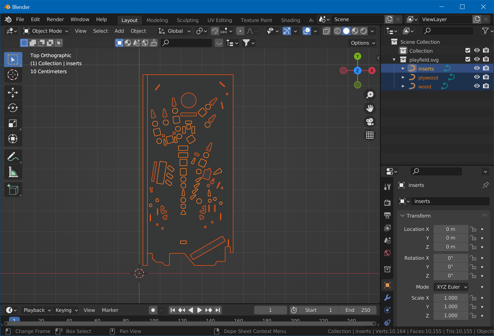

Make sure that all three shapes (inserts, plywood and wood) are there.

## Extrude

Select the *wood* object. Under *Material Properties*, remove the `SVGMat` material so we better see the shape. Convert the shape to mesh by choosing *Object -> Convert To -> Mesh*. Hit `Tab` for edit mode, `A` to select all, then clean up the mesh by going to *Mesh -> Cleanup -> Limited Dissolve*, followed by `M` and *By Distance* (merge by distance).

Hit `E` to extrude, and eyeball it to something more or less accurate - but remember the number (you can of course always measure and type in the number). Hit `Tab` to go back to object mode.

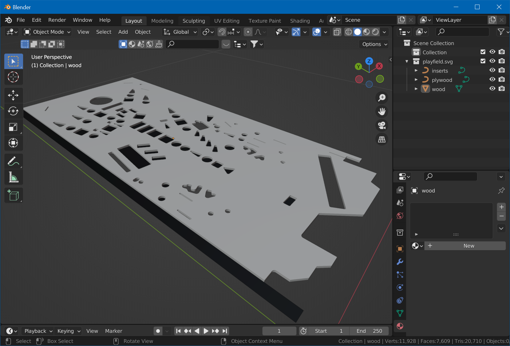

## Smooth

Since our cuts are round, let's smooth out the mesh. Select *Object -> Shade Smooth*. Don't panic, we'll fix the normals. Switch to edit mode (`Tab`) and select one of the top faces. Hit `Shift+G`, *Coplanar*. While holding `Shift`, select one of the bottom faces. Again `Shift+G`, *Coplanar*. `Ctrl+I` to invert the selection. *Select -> Select Loops -> Select Boundary Loop*. You now have all edges of the inserts as well as the outer borders selected.

Make these edges sharp by selecting *Edge -> Mark Sharp*. Hit `A` to select all and choose *Mesh -> Normals -> Reset Vectors*. You should how have a mesh with a flat, uniform top and smooth inserts.

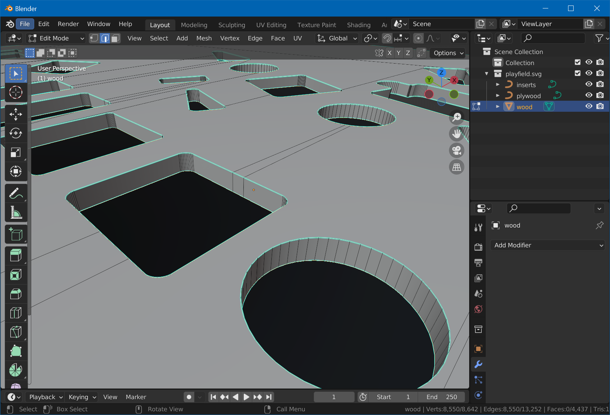

Maybe now it's a good time to save your project. Name it `Playfield.blend`.

## Convert Other Objects

We don't need to extrude the other objects, just convert them to a mesh so we can UV-map them. Exit edit mode with `Tab` and select the *inserts* object. Remove `SVGMat`, select *Object -> Convert -> Mesh*, and hit `Tab` for edit mode.

Press `A` to select all, *Mesh -> Cleanup -> Limited Dissolve*, and `M`, *By Distance*. Exit edit mode by pressing `Tab`. Since we extruded to the top, we need to align the *inserts* mesh. Hit `G`, `Z`, and type the distance you remembered when extruding.

Finally, select the *plywood* object, remove its material and convert it to a mesh as well. The result should look like that:

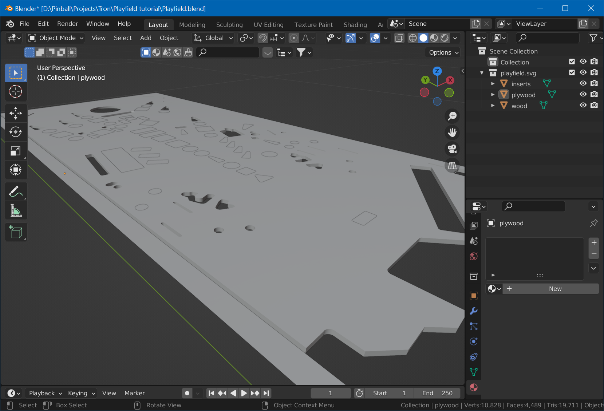

## UV-Map

Now we map our objects so they perfectly align with the masks we've created in the previous step. There is just one add-on for Blender that we need to install first, to make this quick.

It's called *TexTools*. Go to the [GitHub page](https://github.com/SavMartin/TexTools-Blender) and [download](https://github.com/SavMartin/TexTools-Blender/archive/master.zip) the archive of the repo. In Blender, choose *Edit -> Preferences -> Add-ons*, click on *Install*, select the downloaded archive, and enable the checkbox after installation. Then, close preferences.

### Seams

Now we'll create seams for the plywood edges so we can easily unwrap them. We'll create them on the side facing the player, so they aren't visible when playing.

Hide the *inserts* and *plywood* objects, and orbit 180° around your table in the viewport. Select *wood*, `Tab` for edit mode, `2` to select edges. Then, `Shift` select one edge of each hole in the mesh. Also select the four outer edges of the mesh. When done, click on *UV -> Mark Seam*.

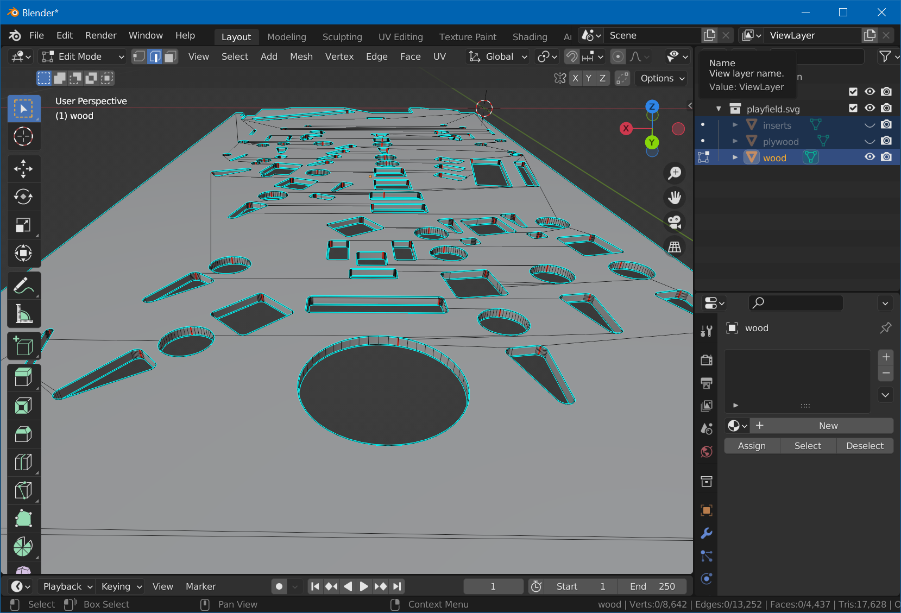

Hit `Tab` to exit edit mode, and unhide the *inserts* and *plywood* objects again. Change to the *UV Editing* workspace. On the right, be sure to be in object mode, hit `7` for top view, and `A` to select all. Then `Tab` for edit mode, and `3` for face selection (it's important to have **all** objects selected before switching to edit mode).

### Top Surface

Let's map the top surface first. Select a face of *wood*'s main surface, hit `Shift+G` and choose *Coplanar*. Make sure that besides the wood surface, also the inserts and the plywood faces have been selected. Then click the *UV* menu and select *Project from View (Bounds)*.

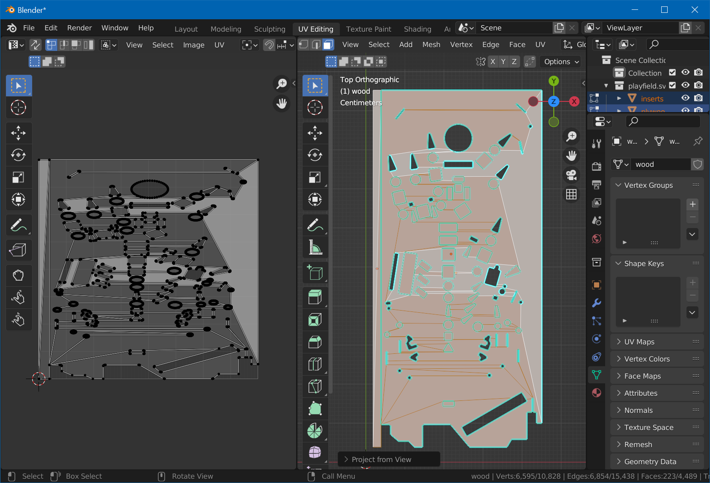

The *Bounds* part is important, because it will spread the map across the entire tile, aligning it with our maps. Hit `Tab` to exit edit mode.

### Bottom Surface

Select the *wood* mesh. Hit `Tab` for edit mode and select one of the faces of the backside. Press `Shift+G` and choose *Coplanar* to select the entire surface. Then hit `7`, `9` and choose *UV -> Project from View*. On the left, move the mesh outside of the UV tile by selecting the island and hitting `G`.

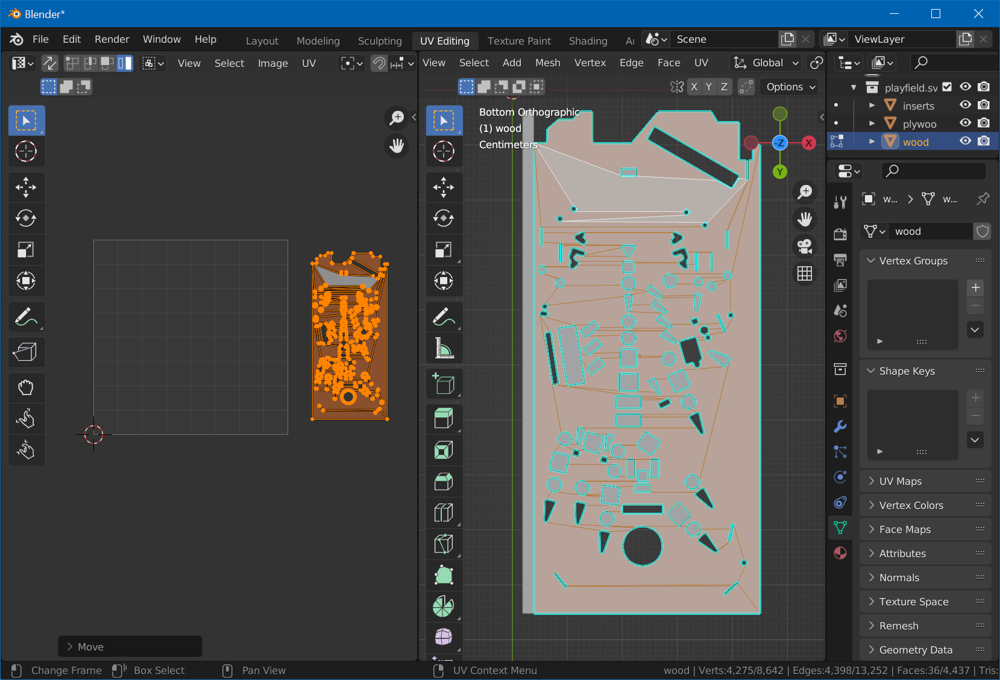

### Plywood Edges

Next are the plywood edges. With the bottom surfaces still selected, `Shift`+select one of *wood*s top surface, `Shift+G`, *Coplanar*, followed by `Ctrl+I` (select inverse). Now, only the edges should be selected.

From the *UV* menu, choose *UV Unwrap*. On the left, you should see all edges unwrapped as rectangles.

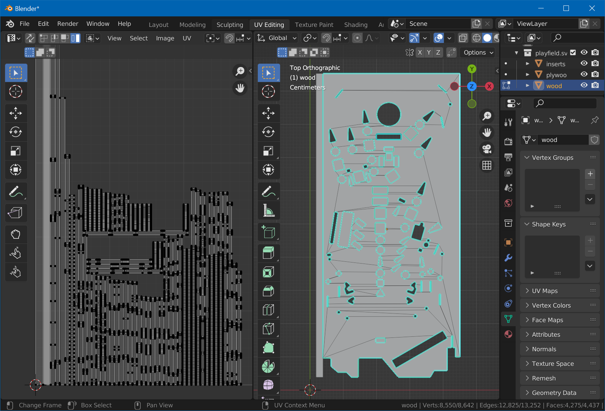

> [!note]
> If you forgot to mark a seam, you'll get circular islands like this:
> 
> 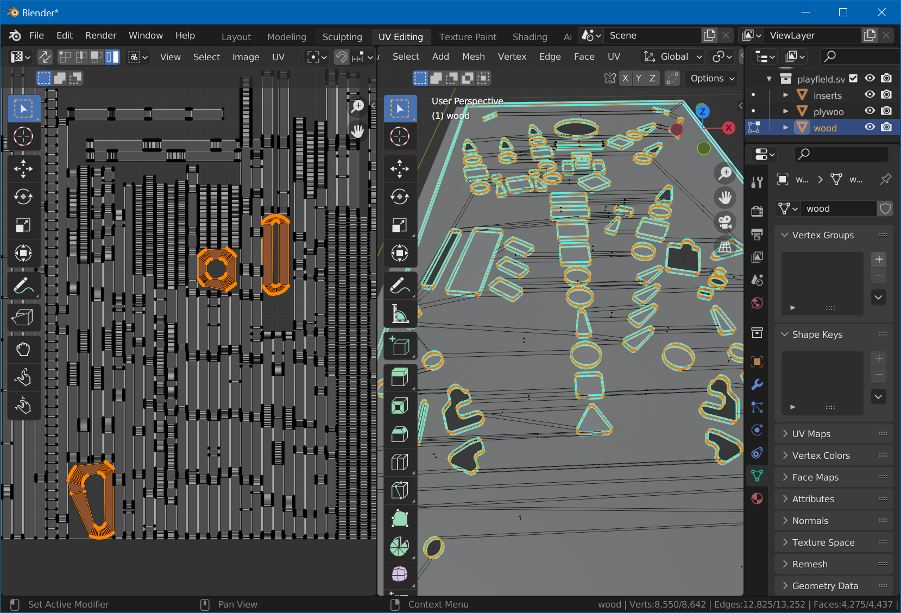
>
> In this case, simply select an edge of each of the island, select *UV -> Mark Seam*, and *UV Unwrap* again.

Now, on the left, hit `4` for island selection mode, and select all horizontal islands. Hit `R`, type `90` and `Enter`. Type `A` to select all islands, open TexTools by hitting `N` and selecting *TexTools*, expand the *UV Layout* section, and *left align* all islands. 

Hit `G`, `X` and move them to the left side, out of the tile.

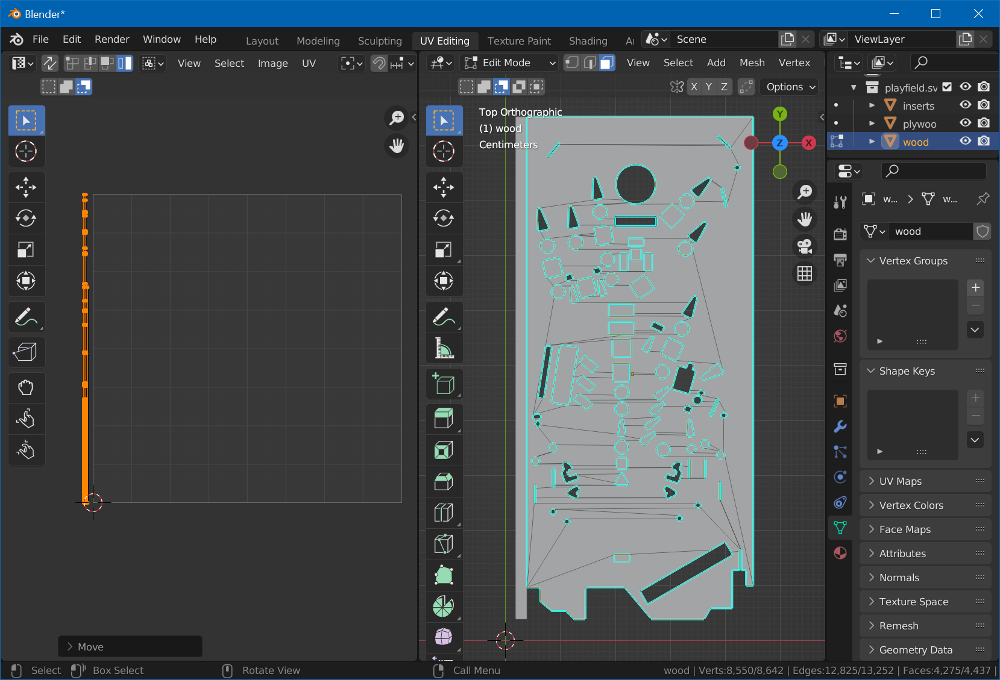

Press `Tab` to exit edit mode.

### Place the Islands

Now we need to place the edge islands as well as the bottom surface back on the tile. We didn't do that before, because we need the top surface mapping visible in order to know where to place them.

On the right side, hit `A` to select all, then `Tab` to enter edit mode. Move the split view a bit to the right, so you'll have more space on the left.

First, by using `G`, `R` and `S`, place the bottom surface wherever there is a bit space left. Then, grab all the edge islands and make them fit into the *plywood* rectangle. It doesn't have to be super precise, since you can later align the texture in Substance, but it shouldn't overlap with the top surface and should stay inside of the UV tile.

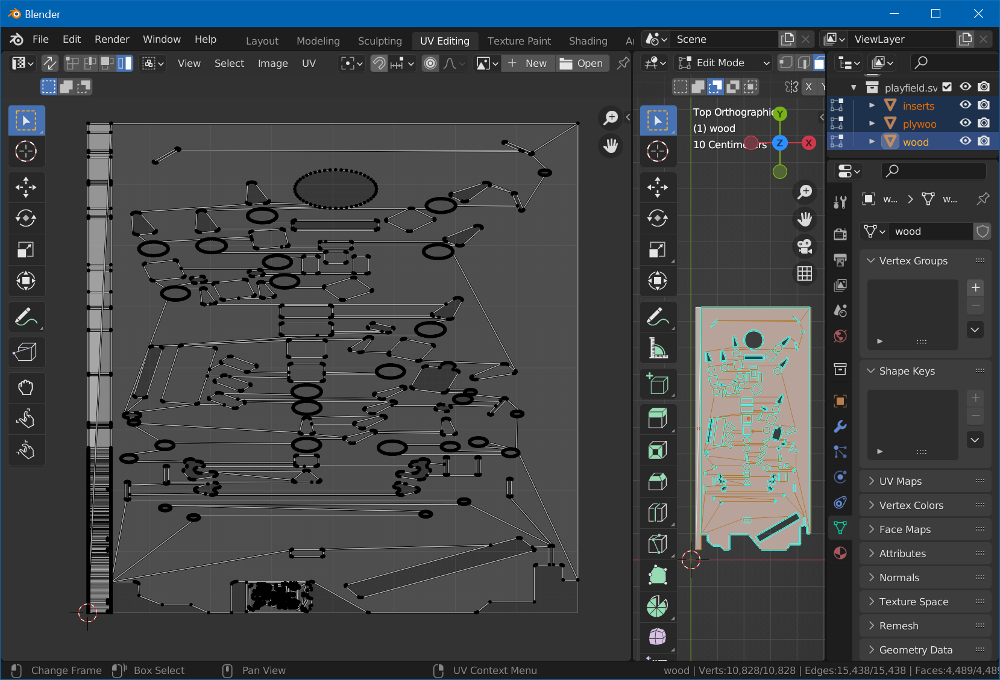

You might need to X-resize some of the edge islands. The goal is to fit them all in on top of the *plywood* object.

## Export

Mesh work is nearly done :)

Back in the *Layout* workspace, in object mode, select *wood* and under *Modifier Properties*, add the *Triangulate* modifier. Do the same for *inserts*.

Then, select *inserts* and *wood*, then select *File -> Export -> FBX (.fbx)*. Check *Limit to Selected Objects*. Name it `Playfield.fbx` and hit *Export FBX*.

[Let's texture this](xref:tutorial_playfield_3)!