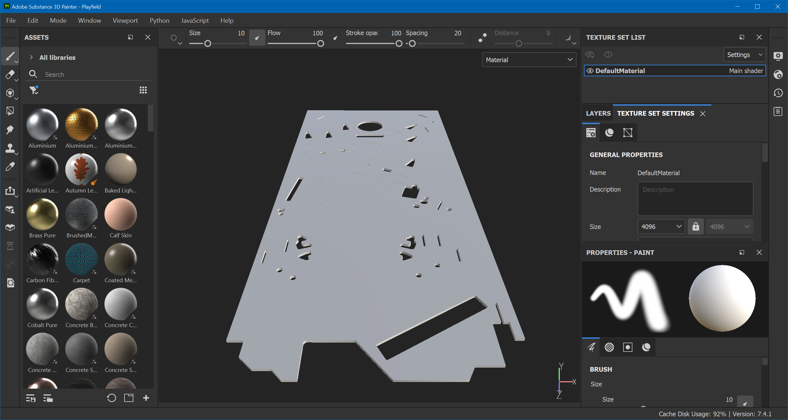
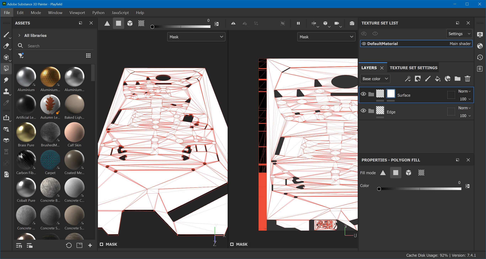
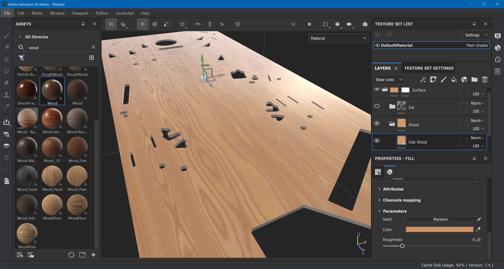
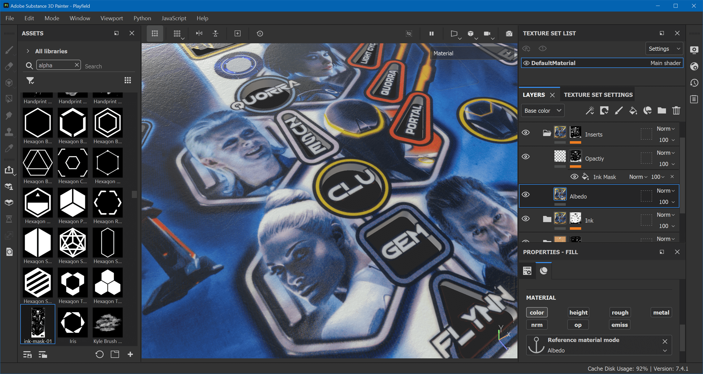
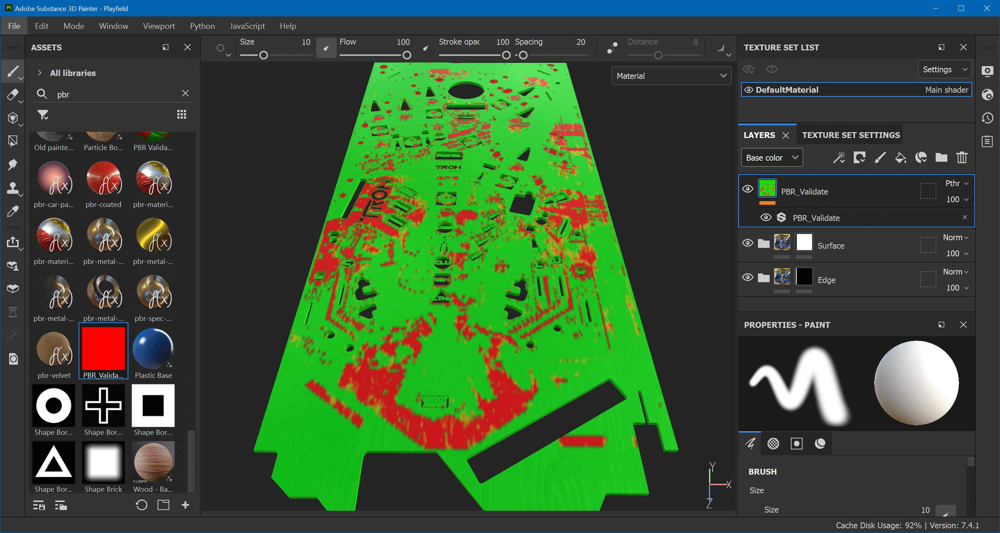
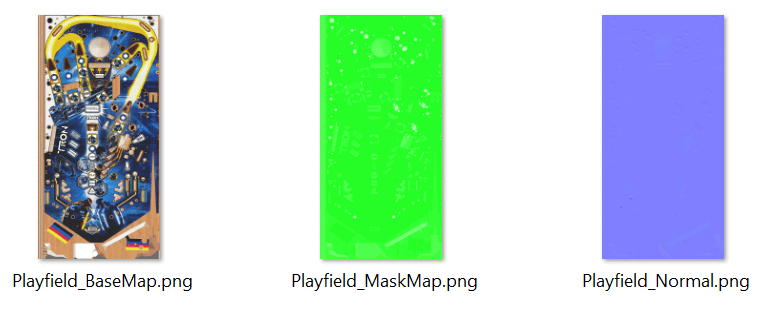

# Texturing

We'll be creating a rather sophisticated material for our playfield. There will be a bunch of different materials, which alltogether will result in a PBR texture set that we can use in Unity.

Start up Substance Painter. Select *File -> New* and use the *PBR - Metallic Roughness Alpha-blend* template. Set the document resolution to 4096 and select your the FBX file exported from Blender. Save your file as `Playfield.spp`.

## Setup

Let's start by masking out the top surface and the plywood edge. Under *Layers*, delete *Layer 1* and create two folders. Name them *Edges* and *Surface*.

- Right-click on the *Surface* layer and choose *Add white mask*
- Hit `F1` to see both the 3D view and UV tile
- Select the *Polygon Fill* tool
- Set the color to black (1)
- Draw a rectangle over the UV tile's left border to fill the edge polygons
- Alt-click on the mask to verify that only the left border is black:
  

Do the same for the *Edges* layer, but invert the mask:

- Right-click on the *Edges* layer and choose *Add black mask*
- Set the color to white (0)
- Draw a rectangle over the UV tile's left border to fill the edge polygons
- Alt-click on the mask to verify that only the left border is white:
  

Hit `F2` to show the 3D view only, and select *Material* in the top right corner.

## Ink Material

Create a new folder inside of *Surface* and call it *Ink*.

### Albedo

Inside of *Ink*, create a fill layer and name it *Albedo*. Under *Properties*, `Alt`-click on *Color* to make it albedo only. Grab `albedo.png` from your file system's explorer and drag and drop it into the *Assets* panel (on the left side). 

In the import dialog, click on *undefined* and select *texture*. At the bottom select to import to *project 'Playfield'*. Drag *albedo* from the assets panel into the *Base color* channel of the *Albedo* layer. Finally, right-click on the layer and select *Add anchor point*.

### Height and Roughness

We're going to stack three effects on top of each other:

1. In a CMYK printing process like a playfield, each color gets applied on top of each other. What we can do to mimic this effect is to grab the grayscale image of the albedo and interpret it as height map, where black is highest and white lowest.
2. Ink is never applied perfectly evenly, so there are little bumps that should be visible.
3. A playfield that has been in use has micro scratches from the ball.

But first, let's set the base values. Just above the *Albedo* layer, create a new fill layer and call it *Base Height/Roughness*. Under properties, `Alt`-click on *height* and (normal) click on *rough*. Set the height to `0.0040` and the roughness to `0.15`.

#### Noise and Scratches

Now we're going to add another layer that contains the ink imperfections and the micro scratches.

- Add a new layer above *Base Height/Roughness* and call it *Wear*.
- In the *Properties* panel, `Alt`-click on *height* to make it only affect the height.
- Set `Height` as uniform color to `-0.1`.
- Right-click on the layer and add a black mask.
- Add a fill to this mask and call it *Noise*.
- Click on *grayscale* and search for *Fractal Sum 1*.

Zoom in a bit, and rotate the environment map with your mouse while right-clicking while holding `Shift`. Move the light source in front of you so you see the reflection of the height.

Now, this is way too much noise, but it allows us to tweak it better before we tune it down. The first thing to do is not to UV-project, which is the default. In general, you should only UV-project when you know that the aspect ratio of your UV mapping is correct, which isn't the case here.

So, the *Noise* fill still selected, change the *Projection* under *Fill* to *Tri-planar projection*. You'll immediately notice how the noise is less skewed.

Then, the size is way to high as well. Still under *Properties*, look for *UV transformations*, and set the scale to `5`. Finally, make the effect more subtle by selecting the *Wear* layer (not the mask), and changing the *Height* at the bottom of *Properties* from `-0.1` to `-0.01`.

That's better. Now let's add some scratches. Click on the mask of *Wear* again, and add another fill, above *Noise*. Call it *Scratches*. You'll notice that this makes the noise disappear, but that's fine for now. Under *Properties*, change the *Projection* to *Tri-planar projection* like before.

Click on the *grayscale* button and search for a texture named *Grunge Scratches*. You'll notice that the scratches now actually pop up instead of going down. Let's fix that by setting *Invert* to *true* down under *Parameters*.

In order to get the noise back, change the blend mode of *Scratches* to *Linear Dodge (Add)*. Use the slider just besides to make the effect more subtle. Do the same for the *Noise* fill until you're happy with it. 

Here, it looks good on with *Noise* at `70` and *Scratches* at `40`. You always tweak this later.

#### Ink Height

Create another fill layer above *Wear* and call it *Ink Height*. `Alt`-click on *height* to make it height-only and set the height to `-0.1`. Right-click on the layer add a black mask. Add a fill to the mask and name it *Ink Alpha*.

Click on *grayscale* to select a texture, switch to the *Anchor Points* tab and select *Albedo*. Again, much too high, so select the layer again and dial in the height. Here, it looks good around `-0.0088`. Sublety is key.

## Wood

Having created an ink mask in step 1 allows us to use a proper wood material for what's below the ink. Under the *Ink* layer, add a new folder called *Wood*. 

Now, a good wood material that works well for playfields is titled "Oak Wood" by Casimir Perez. It's part of Adobe's free Substance materials, and you can download it [here](https://substance3d.adobe.com/community-assets/assets/75c37499062d5198057e10751fc6fdb3ca26ab20). 

After downloading, drop it into the libary and from the library into the *Wood* folder. Hide the *Ink* layer so we can parameterize it correctly. I've found the following setting to work well:

- Projection: Tri-planar projection
- Scale: `5`
- Rotation: 90°
- Color: `#CC9166`
- Roughness: 0.18

Also, hit *Random* a few times if you don't like the pattern.

Let's mask this out, since we don't want any of the channels influence the ink, and we don't want wood under the meshes that covers the inserts either. Right-click on the *Wood* folder, add a white mask with a fill named *Wood Mask*.

Drag and drop `wood-mask-01.png` into *Assets*, import it as *alpha* into *project 'Playfield'*. Then drag the imported texture on *Wood Mask*'s grayscale. This does the inverse of what we want (i.e. it shows the wood only over the inserts). To fix this, right-click on *Wood Mask*, choose *Add filter*, click on *filter*, and choose *Invert*.

Now we have masked out the inserts, but we still have wood over the ink. To fix this, create a new fill above the *Invert* filter, name it *Ink Mask*, import `ink-mask-01.png` and assign it to the fill. Select the blending mode to *Multiply*.

In order to make the wood visible below the ink, do the following:

- Re-enable the *Ink* layer
- Add a white mask to the *Ink* layer
- Add fill called *Ink Mask* to the mask
- Click on *grayscale* and search for *ink-mask-01*.
- On top of *Ink Mask*, add an *Invert* filter

Your playfield should now have the ink properly masked out and sitting on top of the wood.

## Inserts

Let's look at the inserts. What we want is to apply our ink mask as an alpha mask on the insert meshes. Create a new folder layer above *Ink* and call it *Inserts*.

Add a white mask and a fill called *Wood Mask*. Click on *grayscale* and search for *wood-mask-01*.

Within the *Inserts* folder, create a new fill layer and name it *Opacity*. `Alt`-click on *op* under its properties to only activate the opacity. Set the opacity to `0`.

Right-click on the *Opacity* layer, add a white mask with a fill named "Ink Mask", and set the fill's grayscale to *ink-mask-01*.

Unfortunately, this results in edges around the ink over the inserts, since the albedo below has been masked out by the wood mask. In order to fix that, add another fill layer below *Opacity*, make it *color* only, and assign the *Albedo* anchor point to its color.

This should make the insert overlay to be cut out correctly.

## Fake Holes

Remember the fake holes mask we've created so we can use them as markers on the playfield? Let's do those. Create a new folder layer above *Inserts* called *Fake Holes*. But before we add anything to it, we need to mask out a few things.

Click on the mask of your *Wood* folder, the *Ink Mask* is the top fill. Add another fill called *Fake Holes Mask*. From your file explorer, drop `fake-holes-mask-01.png` and import it into your project as an alpha. Assign it to the *Fake Holes Mask* fill, and set the blend mode to *Subtract*.

You should now see masked out gray spots in your wood. Go back to your new *Fake Holes* layer, and add a white mask with a fill called *Fake Hole Mask*. Click on *grayscale* and find *fake-holes-mask-01*.

In the *Fake Hole* folder, add a new fill layer and call it *Material*. Only enable *color*, *height* and *rough* on it. Set the color to `#050505`, the height to something like `-0.08`, and roughness to let's say `0.7`.

## Edges

We have ignored the edges so far. Create a new fill layer under the *Edge* folder. Name it *Albedo* and `Alt`-click on *color* to make it color-only. Click on *Base color* and search for *albedo*. This will directly apply the texture as you have mapped it in Blender.

If you want to align the mapping, hit `F2` to see the mapping on the UV tile, which allows you to resize and move the texture. You could also use a completely different texture of course.

## Wrapping Up

This tutorial is already long enough, so we've created a separate annex for dealing with our mylar sticker and silver screening. Here, we're going to wrap up and get this exported. But first, there is one last thing we need to do, which is making sure our material is PBR valid.

PBR valid basically means that the color of your textures aren't too light or too dark. There is no such thing as absolute black in the nature, and if we provide such values, there will be problems when rendering later. More literature about this [here](https://substance3d.adobe.com/tutorials/courses/the-pbr-guide-part-2) under "Base Color (RGB – sRGB)".

Download the free ["PBR Validate" smart material](https://stylizedstation.gumroad.com/l/PBRValidate) and drop it at the top of your layers. Here, it looks like that:

Red means there's a problem. This is most definitely the playfield's albedo that is too dark. Adding a *Levels* effect to the ink's albedo and pushing up the lower boundary to 0.01 already solves most of the problems. We need to copy/paste it to the insert's albedo as well though.

The rest seems related to the fake holes. Looks like `#050505` was way too dark. Pushing up to `#1E1E1E` turns the rest of the playfield green.

## Export

First of all, if you have come so far, congrats. That was quite a ride. The rest is a lot easier.

What Unity needs is a set of maps. In HDRP, those maps are the base map (aka albedo), a [mask map](https://docs.unity3d.com/Packages/com.unity.render-pipelines.high-definition@12.1/manual/Mask-Map-and-Detail-Map.html), and a normal map. Substance Painer can generate those automatically.

However, since Painter usually deals with multiple materials, it will add the material name into each map's file name. For the playfield, we don't want that, because we only have one material.

If you go to *File -> Export Textures*, a dialog pops up where you can edit the output templates. Click on the tab called *Output Templates*, and find the one called *Unity HD Render Pipeline (Metallic Standard)*. Click the *duplicate* icon on the top, and double click the copy to rename. I just called it *Unity HDRP*. The three maps are named:

- `$mesh_BaseMap(_$colorSpace)(.$udim)`
- `$mesh_MaskMap(_$colorSpace)(.$udim)`
- `$mesh_Normal(_$colorSpace)(.$udim)`

I've removed the emissive map, because I never need it.

Hit *Save Settings* to close, because we want to do one last thing before exporting first. In the *Texture Set Settings* panel, disable the lock icon and set the texture resolution to 2048×4096. This will not squeeze your 2:1 playfield into a 1:1 texture anymore, but use a more appropriate aspect ratio.

Now, to export, click again on *File -> Export Textures*, select the folder where you want to put your textures in (usually in your Unity project folder at `Assets/<table name>/Textures`), change the output template to *Unity HDRP* (the one you created before), and hit *Export*.

> [!note]
> If you happen to have an 8K playfield scan, you can set the *Size* to `8192` before exporting. This will write your maps at 4096×8192.

On first sight, the result doesn't look like much, so let's bring this into Unity!
