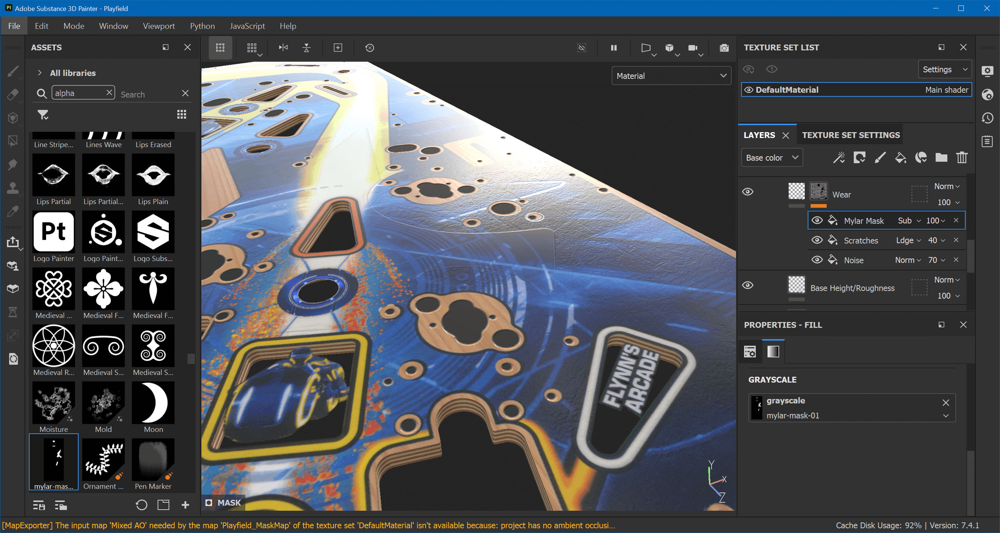
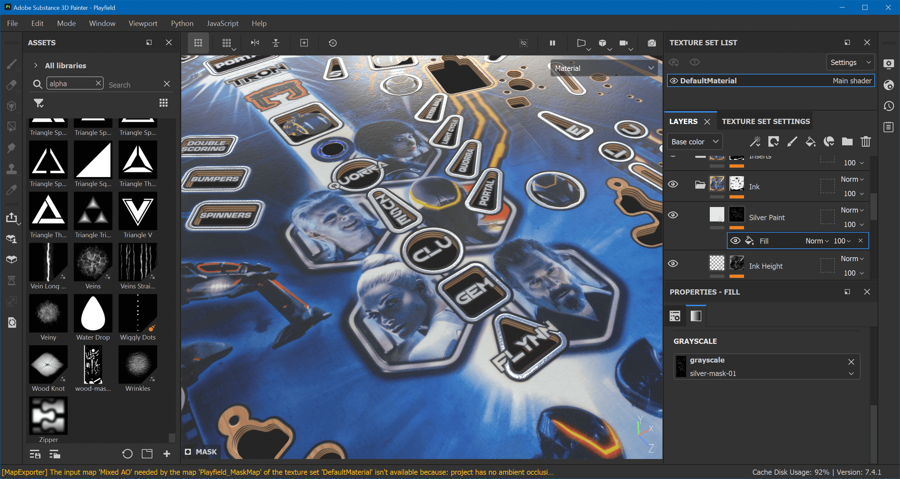

# Texturing (advanced)

Most projects probably don't have Mylar stickers or silver paint on the playfield, which is why we decided to dedicate a separate page for this. If you have something similar to add to your playfield, do it before the [Wrapping Up](xref:tutorial_playfield_3#wrapping-up) section of *Texturing*.

## Mylar Stickers

We find those in-between the bumpers and at a few other places, and their texture is obviously different than the rest of the playfield.

First of all, we don't want the wear of the ink to influence our stickers. So go down to *Ink* and click on the mask of the *Wear* layer. Add a new fill effect above *Scratches* and name it *Mylar Mask*. Set the blend mode to *Subtract*. Import `mylar-mask-01.png` as alpha, and assign it to the fill effect's grayscale. The sticker is already visible:

Go up to the top and create another folder layer above our existing *Fake Holes* layer, and call it *Mylar*. Add a white mask and a fill effect named *Mylar Mask*, and search for *mylar-mask-01* for its grayscale.

We're going to create two fill layers in here. One for the general height and roughness, and another for the texture. Name the first *Base Height/Roughness* and the second *Texture*. The second sits above the first.

### Base Height/Roughness

Select this layer and disable all channels but *height* and *rough*. We want the sticker to come up, so set the height to something small like `0.0016`. In terms of roughness, we want the sticker to be "less glossy" than the ink besides it, so `0.17` looks like a good value.

### Texture

The texture should only be applied to *height*, so `Alt`-click on it. For its values, I've gone for *Directional Noise 4* with *Tri-planar Projection* and otherwise default parameters. At 100% this effect is way too high, so I've set the view mode of the layers to *Height* in order to be able to turn down the opacity to `4`.

The final result looks like this:

## Silver Paint

The silver paint goes around the inserts, where our Pro playfield scan has normal ink. Due to our height map, that means a slight downwards bevel, where it actually should go up. Let's fix that.

Under the *Ink* layer, we have another *Ink Height* layer, which has *Ink Alpha* on its mask. Add another fill effect above and name it *Silver Height*. Set the blending mode to *Subtract*. For the grayscale values, import `silver-mask-01.png` and assign it.

Then, add another fill layer above *Ink Height* and name it *Silver Paint*. Make it apply to *color*, *height*, *rough* and *metal* with the following values:

- Color: `#E7E7E7`
- Height: `0.02`
- Roughness: `0.0837`
- Metallic: `1`

Finally, apply the silver mask to the layer. The result is a nicely reflective material around the inserts:

