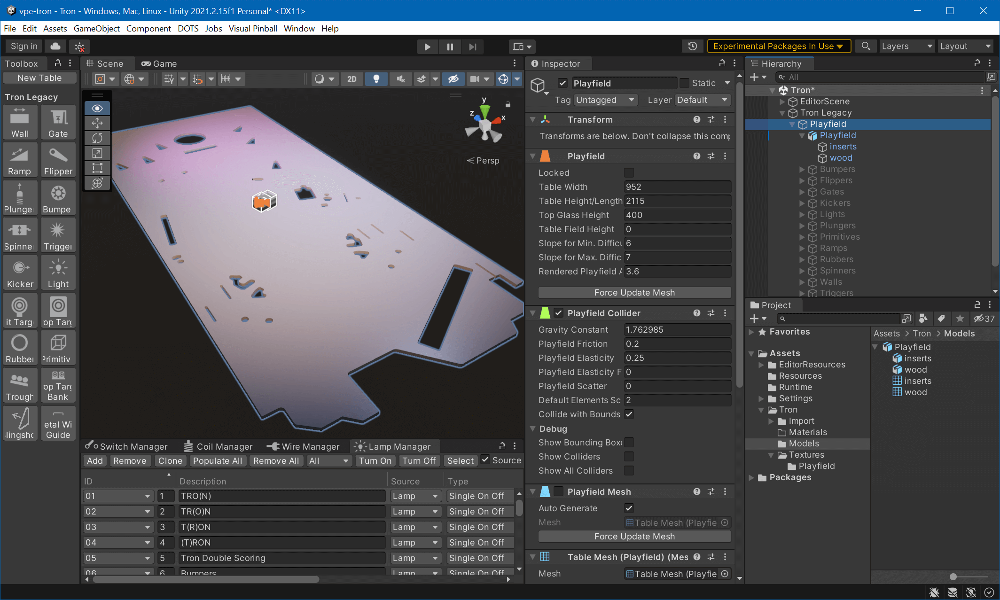
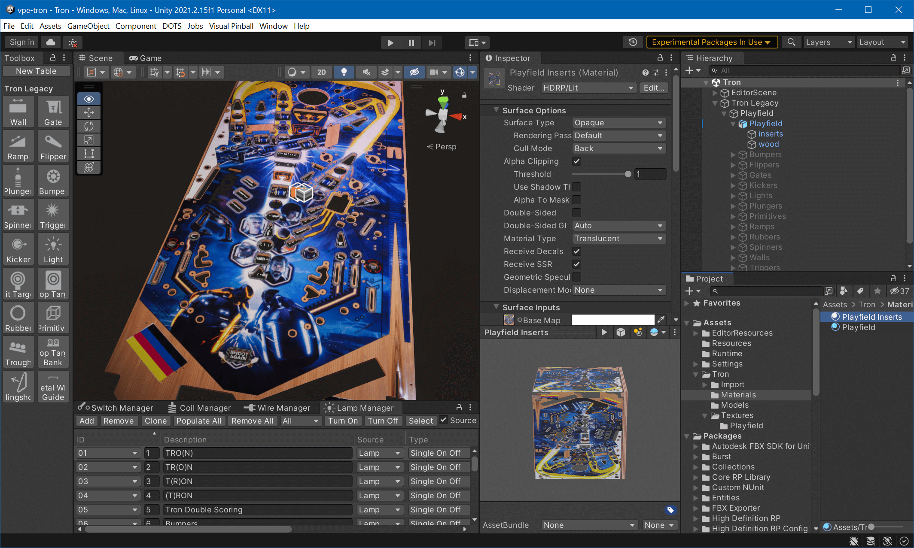

# Import Into Unity

In the last part of this tutorial, we'll import and place the model into the Unity scene, create materials and assign them to the model.

## Import Files

First, let's bring our files into the Unity project. There are four files that go into the `Assets` folder: The three maps and the FXB file. Copy the FBX file into `Assets/Tron/Models` and the textures into `Assets/Tron/Textures/Playfield`.

While the import options for the FBX file are fine, we need to adjust them for the textures.

Select the base texture and change the following options in the *Inspector*:

- Alpha Is Transparency: *enabled*
- Max Size: `4096` (or `8192` if you exported at 8K in Substance)

Hit *Apply*. The mask map:

- sRGB (Color Texture): *disabled*
- Max Size: `4096` (or `8192` if you exported at 8K in Substance)

Hit *Apply*. The normal map:

- Texture Type: *Normal map*
- Max Size: `4096` (or `8192` if you exported at 8K in Substance)
- Compression: *High Quality*

Hit *Apply*. Now we got our files ready. Let's bring in the model.

## Import Model

The idea here is to put the model at the same position as the original playfield, and then hide the original playfield. Since this is the probably the first tutorial for many, we'll go a bit more into details of how Unity works and its quirks.

This is our starting point. The playfield is the original import from a VPX file, and all the other elements are hidden. You can hide elements by selecting them and unchecking the top-left checkbox in the *Inspector*.

> [!note]
> **Crash course in *Scene* navigation**
>
> Move the camera like in a first-person shooter. Hold the right mouse button, then use the `WASD` keys for horizontal movement, `Q` and `E` for vertical movement. The mouse wheel changes the movement speed. Just panning the screen is done while holding the middle mouse button. Full documentation [here](https://docs.unity3d.com/2021.2/Documentation/Manual/SceneViewNavigation.html).

In the *Project* panel you see our FBX file. It's a tree structure because Unity imported it and found out that it contains two objects and two meshes. Drag the entire *Playfield* object from the *Project* panel into the *Hierarchy* and drop it over the *Playfield* GameObject.

You'll probably see... nothing. That's because the scale of the playfield model is completely off the charts. While your new *Playfield* GameObject is selected (which, by the way, I'd like to move to the top among its siblings), move your mouse over the *Scene* (the 3D viewport), and press `F` for focus. Unity now zooms in (our out?) to your imported playfield.

It does it with an animation, so that gives you a hint whether the imported playfield is too large or too tiny to be seen. In our case, it zoomed in, but it's still too tiny to be visible. In this case, an approach is to click on the parent GameObject (also called *Playfield*), hit `F` to zoom out again, and start increasing the *Scale* of our imported model in the *Inspector*. Before doing that, click the little chain icon to lock the proportions.

At scale `1000` we're starting to see something. However, it's oriented incorrectly. Setting the X-rotation to `-90` and Z to `180` fixes that. Now, we need to align the model over the existing one. For that, let's switch into orthogonal camera view by clicking on the small *Persp* icon in the top right corner of the *Scene* view, followed by a click on the Y axis of the 3D gizmo to switch to *Top View*. Click the [shading mode icon](https://docs.unity3d.com/2021.2/Documentation/Manual/ViewModes.html) and choose *Wireframe*. This allows you to align the playfield without anything being hidden.

Using the move (`W`) and scale (`R`) gizmos to align the imported playfield with the existing one.

> [!warning]
> When the camera is in orthogonal mode, it can happen that nothing is rendered or that meshes start disappearing. This is due to camera clipping. To fix, move the camera back by pressing `S` while holding the right mouse button.

Once done, switch the shading mode back to *Shaded*, select the parent *Playfield* GameObject in the *Hierarchy* and uncheck the *Playfield Mesh* component in the *Inspector*.

Now, to the fun part.

## Create Materials

We'll need two materials. A solid one for the body and a translucent one for the insert overlays. Select (or create) the *Materials* folder under *Assets* in the *Project* window, right-click on the right and select *Create -> Material*. Name it *Playfield*.

In the *Inspector*, under *Surface Inputs*, you'll see multiple slots for maps. While the *Playfield* material is still selected, change to the `Textures/Playfield` folder where your maps are stored. Then, drag and drop each map to the corresponding slot in the *Inspector*. Your material should look like this:

In the *Project* view, switch back to *Materials*, select *Playfield* and hit `CTRL+D` to duplicate. Name the new material *Playfield Inserts*. While selected, change the *Material Type* in the *Inspector* from *Standard* to *Translucent*. Additionally, enable the *Alpha Clipping* checkbox.

Still in the inspector, scroll down to find *Diffusion Profile* (right below the maps under *Surface Inputs*). Then, in the *Project* window, expand *Packages* and navigate to *Visual Pinball Engine (HDRP) -> Assets -> Settings -> Diffusion Profiles*. Drag the *Plastics* profile into the material's diffusion profile slot in the *Inspector*.

## Assign Materials

Select the *wood* GameObject. In the *Inspector*, inside the *Mesh Renderer* component, expand *Materials* and drag the *Playfield* material from the *Project* panel into the slot where currently *DefaultHDMaterial* is shown.

Select the *inserts* GameObject and do the same with the *Playfield Inserts* material.

This looks pretty good already, but when zooming in, the structure in the reflection is a bit too extreme. This is quickly fixed by decreasing the *Normal Map* parameter in both playfield materials. Here, `0.5` does its job just fine.

## Future Changes

So, you're all happy with your playfield, when suddenly you realize that you need to change something. Here a few hints of what you'll need to do depending on what you need to change.

- **Material Updates** - Updates in Substance Painter are the quickest - Make changes and re-export the textures, that's it. Unity will automatically pick up the changes.

- **Mask/Texture Corrections** - These are pretty painless too - re-import the new image into Painter, then click the *Resource Updater* icon in the left toolbar and hit the *Update* button where it's orange. Then, re-export.

- **Missing Hole** or any geometry changes - This is the annoying one. Since our workflow in Blender is destructive, you'll probably need to recreate the mesh. If you decide to *fix* the geometry of the existing mesh, make sure you update the wood mask accordingly. Before exporting to FBX, make sure you name your objects in Blender the same as before, so Substance Painter can pick them up. If you kept a material in Blender, its name must be the same too for Substance Painter to recognize it. Then, in Painter, select *Edit -> Project Configuration -> Select...* to update your model, and Painter will re-apply the layers on the new model. Finally, re-export the textures and copy the new FBX to Unity's asset folder.

## That's It!

We hope you've enjoyed this tutorial. It might have been one of the first ones you went through. If you were stuck somewhere, please let us know in the [forum](https://vpuniverse.com/forums/forum/174-visual-pinball-engine-general-discussion/) so we can fix it. If you have improvements, use the button on the top right side on each page. More info about that [here](https://github.com/freezy/VisualPinball.Engine/wiki/Documentation).

> [!Video https://www.youtube.com/embed/YX_1ThpWxZg?showinfo=0&loop=0&autopause=0]

Enjoy, and we're looking forward to what you're coming up with!
