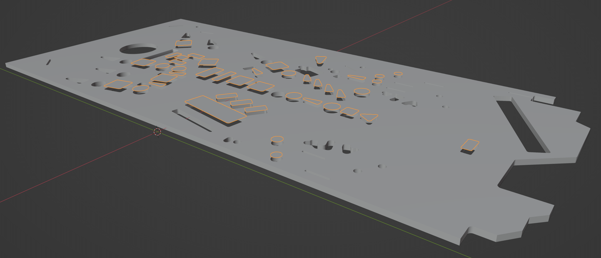
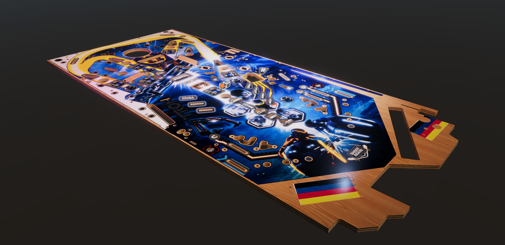

# Create a Realistic Looking Playfield

Every table build starts with the playfield. You'll be looking at it a whole lot of time, so let's make it good-looking. We'll use Photoshop to create the albedo source texture, Adobe Illustrator to mask out the materials, Blender to create the 3D model, and Substance Painter for the texturing.

> [!note]
> We're aware that most of the software used here is commercial and not free. While Illustrator can be easily replaced with Inkscape and Photoshop by any pixel-based image editor, there isn't a good free alternative for Painter yet. Good news is that Blender will invest significantly in texturing tools this year (2022), but until then, you might use the trial version of Painter. There is also a [non-subscription based version at Steam](https://store.steampowered.com/app/1775390/Substance_3D_Painter_2022/).

This playfield is purely for visualization. The advantage of VPE over Visual Pinball is that material properties such as reflection apply to all objects equally, so there is no need for a special "playfield object". We just use the standard "flat" collider, hide its mesh and drop in the playfield we're creating.

If you need more complex collision with saucer notches, that will be part of another tutorial.

## Overview

The result of this workflow are two GameObjects. The first is the wood with holes cut out for inserts and where otherwise visible. The geometry is watertight, and the material is solid.

The other GameObject contains the printed ink above the inserts. It consists of polygons that fit perfectly into the insert cut-outs of the wood. Its material uses the same textures as the wood, but it's translucent.

<small><i>The highlighted polygons represent the ink, elevated for illustration purposes (they will be co-planar with the playfield surface).</i></small>

The material we'll be creating takes into account the difference between the wood and the ink, irregularities of the ink as well as some scratches. 

In this tutorial, we're using the Limited Edition of Stern's *Tron: Legacy* as an example, which has two additional properties: There are mylar protection stickers on the playfield, and some of the ink has a silver screening.

<small><i>The final result in Unity.</i></small>

## Prerequisites

- A playfield scan. It should be at least 2000x4000 pixels of size, and of decent quality, meaning that dust and other artifacts from the scan should have been removed. It doesn't have to PBR-valid, since we'll be dealing with that in Substance Painter.
- You should be familiar with a vector graphics software such as Adobe Illustrator and have basic Photoshop skills.
- You should know your way around in Blender. Beginner level is fine, but you should be able to navigate in the viewport, know what UV-mapping is and know the basics about modifiers.
- You should have a basic understanding of how Substance Painter works.

## Workflow

1. [Create albedo texture and masks](xref:tutorial_playfield_1)
3. [Create mesh in Blender](xref:tutorial_playfield_2)
3. [UV-map texture in Blender](xref:tutorial_playfield_3)
4. [Import mesh and material in Unity](xref:tutorial_playfield_4)
