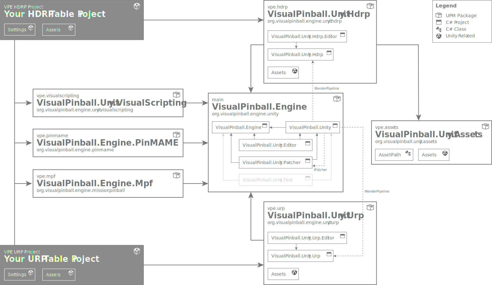

# Overview

The Visual Pinball Engine ecosystem is split across multiple repositories. The main reasons for this are:

- The base engine can stay focused on simulation, file I/O, and Unity integration.
- Render-pipeline support can move at the pace of Unity graphics updates.
- Game-logic integrations can ship native binaries and external runtime dependencies without bloating the core package.
- Large asset libraries can live separately from code-heavy repositories.
- Each package can be versioned and published independently to [registry.visualpinball.org](https://registry.visualpinball.org/).

> [!WARNING]
> VPE is still very much a work in progress. Things are still changing, and we're still far from a state where authors can start building tables.

## Repository map

With that out of the way, here's a quick overview:

The center of gravity is `VisualPinball.Engine`. It contains the simulation core, the main Unity integration package, editor tooling, tests, and this documentation site. The other repositories extend that base package for rendering, game logic, scripting, or content.

### VisualPinball.Engine

This is the main repository and the one most contributors touch first. It contains the platform-independent engine (`VisualPinball.Engine`), the Unity runtime bridge (`VisualPinball.Unity`), the editor package (`VisualPinball.Unity.Editor`), test projects, and the DocFX project under `VisualPinball.Unity/Documentation~`.

If you are changing physics, VPX parsing, table import, common component behavior, or the authoring experience inside Unity, this is usually the right place.

### VisualPinball.Unity.Hdrp

This repository adds the render-pipeline-specific layer on top of the base Unity package. It depends on `VisualPinball.Engine` for the runtime/editor integration and on `VisualPinball.Unity.Assets` for common art content.

Use it for changes that are specific to HDRP rendering, materials, shaders, or package-level graphics setup.

### VisualPinball.Unity.VisualScripting

This package extends Unity's Visual Scripting so tables can drive VPE behavior through graphs instead of handwritten C# code. It is especially relevant for original games, EM-style logic, and hybrid projects where scripting needs to stay accessible to non-programmers.

Use it for node definitions, graph-facing wrappers, or workflow improvements around Unity Visual Scripting.

### VisualPinball.Engine.Mpf

This repository integrates VPE with the Mission Pinball Framework, which runs as a separate Python process and communicates with VPE over gRPC. It is the configuration-heavy option for teams who want to reuse MPF's machine-control model inside a simulator.

Use it when the work involves MPF connectivity, Unity-side MPF components, bridge protocols, or setup around the external Python runtime.

### VisualPinball.Engine.PinMAME

This repository covers ROM-based game logic. It wraps `pinmame-dotnet`, packages native binaries for supported platforms, and exposes the Unity-side integration used by VPE tables that emulate existing solid-state machines.

Use it for PinMAME-specific metadata, plugin deployment, native wrapper work, or Unity integration around ROM-driven tables.

### VisualPinball.Unity.Assets

This is the shared asset library. It keeps reusable content out of the engine repositories and provides meshes, materials, and prefabs that render packages and table projects can consume without duplicating large binary files.

Use it for reusable art content rather than engine or gameplay code.

## Future integrations

The developer guide also tracks design work for integrations that are not yet fully implemented in VPE. These pages are intended to capture architectural direction early, so implementation work across native input, runtime systems, and tooling can converge on the same design.

- [Accelerometer Input Design](xref:developer-guide-accelerometer-input-design) covers analog nudge input, Open Pinball Device support, calibration, and how a future player app should participate in initial setup.
- [B2S Integration Design](xref:developer-guide-b2s-integration-design) proposes modernizing the upstream B2S runtime into a shared cross-platform core with a Windows COM shim, a native second-monitor host, and a Unity texture output for VR backglasses.
- [DOF Integration Design](xref:developer-guide-dof-integration-design) covers a Windows-first `DirectOutput` integration for the future player app and the later hybrid path toward a `libdof` backend.