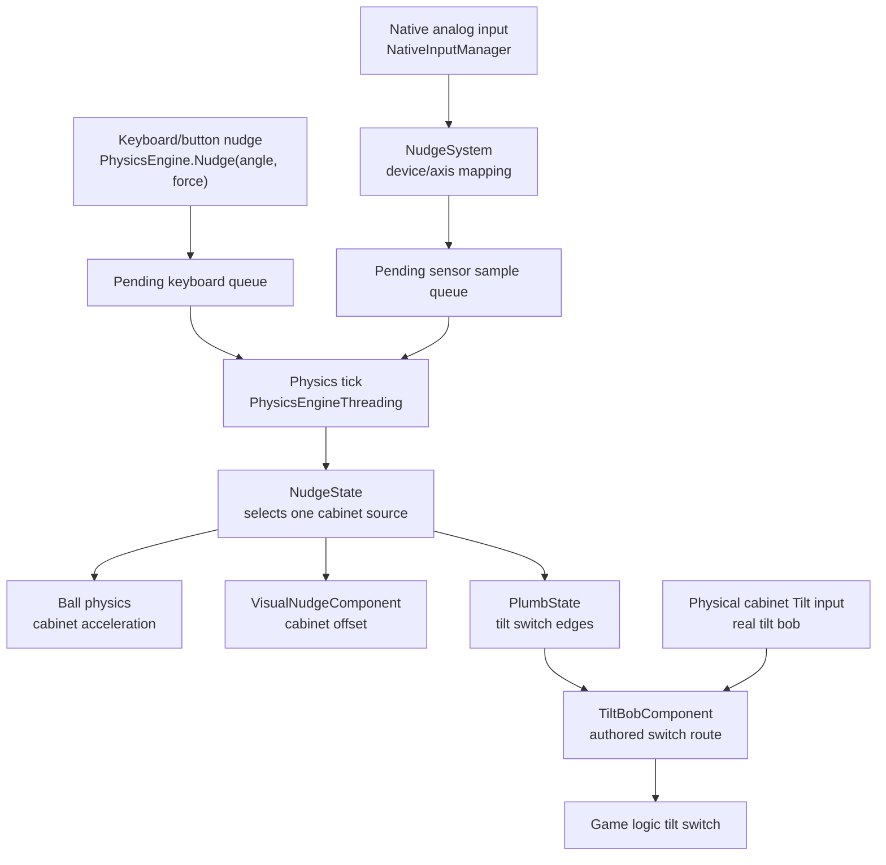

# Nudge System

VPE models nudging as cabinet motion. A nudge is not a special force applied
directly to the ball. Instead, the cabinet/playfield reference frame moves and
accelerates, and the ball reacts to that movement through the normal physics
step. This keeps keyboard nudges, analog cabinet devices, visual cabinet motion,
and plumb-bob tilt on the same physical vocabulary.

The runtime coordinator is `NudgeState`. It owns keyboard nudging, up to four
analog sensor slots, the selected cabinet acceleration for the current physics
tick, the visual cabinet offset, and nudge telemetry. The physics step consumes
`NudgeState.CabinetAcceleration`; rendering consumes `NudgeState.CabinetOffset`
through `VisualNudgeComponent`; simulated tilt uses the same acceleration through
`PlumbState` and routes the resulting switch edges through `TiltBobComponent`.

Much of the model is a C# port or adaptation of the current VP cabinet nudge
code:

- `NudgeState` follows the coordinator shape from
  `vpinball/src/physics/cabinet/NudgeHandler.*`.
- `KeyboardNudgeState` ports/adapts
  `vpinball/src/physics/cabinet/KeyboardNudge.*`.
- `GamepadNudgeState` adapts
  `vpinball/src/physics/cabinet/GamepadNudge.*`.
- `CabinetSensorState` adapts
  `vpinball/src/physics/cabinet/CabinetNudgeSensor.*`, with support code from
  `MotionKalmanAxis.h` and `MotionGainCalibratorAxis.h`.
- `PlumbState` ports/adapts
  `vpinball/src/physics/cabinet/PlumbHandler.*`.

## Data Flow

`PhysicsEngine.Nudge(angleDeg, force)` queues a keyboard-style command. In
threaded mode, native axis input is received on the native input polling thread,
matched by `NudgeSystem`, normalized through `SensorMapping`, and queued into the
simulation thread. Both queues are drained at the deterministic physics cadence,
so all nudge sources advance in one millisecond steps.

Keyboard input intentionally wins while its synthetic cabinet movement is active.
After that, `NudgeState` chooses the most recently active analog sensor. If two
sensors have the same activity timestamp, the stronger cabinet motion wins. This
keeps a deliberate keyboard/button nudge from being diluted by resting sensor
noise, while still allowing multiple cabinet devices to be configured.

## Intent

In this system, "intent" means an input expresses what the player wanted to do,
not what the cabinet physically did.

Keyboard keys, cabinet buttons, and gamepad sticks are intent sources. They say
"nudge left now" or "nudge forward now"; they do not measure a real cabinet
trajectory. VPE converts that request into a synthetic cabinet impulse and then
lets the cabinet spring model ring down.

Some real accelerometer devices can also be used as intent sources. A
`CabinetIntent` sensor reads cabinet acceleration, detects the nudge attempt,
and feeds a synthesized cabinet impulse. This is useful when a physical sensor is
too noisy, too device-specific, or too hard to scale as direct measured motion,
but still clearly identifies that the player hit the cabinet.

Direct cabinet sensors are different. A `CabinetDirect` sensor is treated as
measured physical motion. Its velocity and/or acceleration channels are filtered,
scaled, and fed into the cabinet model as the cabinet's actual movement.

## Source Types

`KeyboardNudgeMode` controls how digital nudges become cabinet motion:

| Mode | Purpose |
| --- | --- |
| `PushRetract` | Legacy VP-style instant shove/retract pulse. |
| `BoxModel` | Legacy VP box model where a table-space offset springs back to rest. |
| `CabModel` | Cabinet oscillator model used by the new nudge stack. |

`NudgeSensorType` controls how an analog slot is interpreted:

| Type | Channels | Meaning |
| --- | --- | --- |
| `GamepadIntent` | `X`, `Y` | Stick/controller axes as player intent. |
| `CabinetIntent` | `AccelerationX`, `AccelerationY`, optional velocity channels | Measured cabinet acceleration interpreted as a nudge attempt. |
| `CabinetDirect` | `AccelerationX`, `AccelerationY`, optional velocity channels | Measured cabinet motion used directly. |

Gamepad intent intentionally does not imply that the controller has an
accelerometer. For example, a typical Xbox controller can be mapped through stick
axes, but it should be treated as `GamepadIntent`, not as a cabinet sensor.

## Sensor Mapping

Analog mappings are stored as compact strings and parsed into `SensorMapping`
objects at runtime. The string format is used because native device IDs can
contain punctuation and because the same values need to survive player JSON,
table packaging, and editor presets.

A mapping identifies:

- Native device ID.
- Native axis ID.
- Axis kind: `Position`, `Velocity`, or `Acceleration`.
- Dead zone.
- Scale.
- Limit.
- Raw neutral center.

The native input thread emits raw axis values. `SensorMapping.ProcessRawValue()`
subtracts the saved raw center, applies dead zone/scale/limit, and returns the
normalized value queued into physics.

## Mount Orientation

Cabinet devices are often installed in different physical orientations. Each
sensor slot therefore has a mount transform:

- `NudgeSensorMountRotation`: 0, 90, 180, or 270 degrees.
- `MountMirror`: mirror the board X axis before rotation.

`NudgeSensorState` applies this transform at the slot boundary before dispatching
samples to the gamepad or cabinet implementation. This keeps the rest of the
physics code in cabinet-space X/Y coordinates regardless of how the board is
mounted.

## Tilt Bob Routing

`PlumbState` is deliberately only the physics-side bob simulation. It produces
tilt switch edges when cabinet acceleration swings the bob past the configured
threshold, but it does not know which ROM/table switch should receive that
signal.

`TiltBobComponent` is the table-authored route and owns the simulated bob's
damping and threshold angle. If the table contains this component, the switch
manager can map the game logic tilt switch to the component's `tilt_bob_switch`
item. If the component is absent, VPE disables the physics plumb route for that
table and does not listen to the player's cabinet Tilt input for plumb tilt.

The source is player/cabinet configuration, not table configuration:

| Mode | Source |
| --- | --- |
| `Simulated` | `PhysicsEngine` drains `PlumbState` edges and the component forwards them to its mapped switch. |
| `Physical` | Native input or Unity Input System `Tilt` action changes are queued to the component, which forwards the real cabinet bob state to its mapped switch. |

This separation is important because the table knows where its tilt switch is
routed, while the cabinet owner knows whether tilt should come from simulation
or from a real physical bob.

## Calibration

`SimulationThreadComponent.CalibrateNudgeSensorCenters()` captures the current
raw value of every mapped axis and stores it as that mapping's neutral center.
`ResetNudgeSensorCenters()` clears those saved centers.

This is intentionally center calibration, not gain calibration and not noise
removal. It solves the common case where a resting KL25Z/Pinscape board does not
report exactly zero. It does not choose better axes, remove spikes, or determine
the correct scale. For direct cabinet sensors, `CabinetSensorState` still runs
its physics-side filtering and gain calibration from live motion data.

Calibration should be performed while the cabinet is at rest and the sensor is
already mapped to the intended axes.

## Settings

Cabinet input settings are shared between editor defaults, runtime components,
and the player app:

| Type | Responsibility |
| --- | --- |
| `CabinetInputSettings` | Native input enablement, polling interval, and nested nudge settings. |
| `CabinetNudgeSettings` | Keyboard mode/strength/damping, visual strength, player tilt-bob source mode, and sensor list. |
| `CabinetNudgeSensorSettings` | Serializable shape for one sensor slot. |
| `CabinetInputSettingsAsset` | Optional editor preset/default wrapper. |
| `TiltBobComponent` | Table-authored switch route plus simulated tilt-bob damping and threshold. |

`CabinetInputSettings.ApplyTo(tableRoot)` finds the table's `PhysicsEngine` and
`SimulationThreadComponent` and applies the correct subset to each. The player
configuration uses the same `CabinetNudgeSettings` shape, so runtime UI and
editor/direct-play configuration do not need to maintain parallel models.

Hardware mappings are still considered user/cabinet configuration. A table can
carry defaults for direct editor play or a known cabinet setup, but the built
player should normally write user-specific settings to player configuration
rather than modifying project assets during play.
