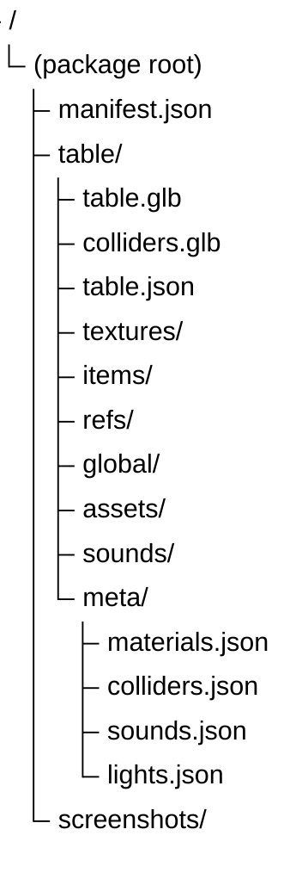

# Packaging

*This section explains the `.vpe` table format.*

A `.vpe` file is a ZIP container, split into a few layers with different jobs. We've tried to use open and documented formats throughout: the scene is glTF, every metadata file is JSON, and textures are stored as their original PNG/JPEG source files. Basically, VPE is trying to solve two problems at once:

- package a table losslessly, in a way that stays editable and re-exportable
- keep the package independent from any specific render pipeline, while still loading fast

So, the scene itself lives in glTF. Gameplay and authoring metadata live in JSON. Material behavior that glTF cannot express cleanly is described in VPE's own vocabulary, with texture bytes stored as separate source image files. The package ships lossless sources only; the GPU-ready (cooked, block-compressed) form is derived on the player's machine on first load and cached locally — it is never shipped. See [Benchmarks](benchmarks.md) for why.

## Container Structure

The package looks like this at a high level:

The exact file and folder names are centralized in `PackageApi`, and every JSON file is written through `PackageApi.Packer` (currently `JsonPacker`, so the extension is `.json`).

| Part | Why it exists |
| --- | --- |
| `manifest.json` | Root manifest with the container format version. Nodes are addressed by stable ids carried in glTF node extras (`vpeId`). |
| `table/table.glb` | Carries the visible scene graph: hierarchy, transforms, meshes, lights, and imported fallback materials. For materials VPE captures, the GLB carries **no** image bytes — those move to `table/textures/`. Only unsupported-shader materials keep their textures in the GLB. |
| `table/colliders.glb` | Carries meshes that exist for physics but are not naturally part of the visible glTF export. |
| `table/table.json` | Carries table-level metadata from `TableComponent.Metadata` (`TableMetadata`). |
| `table/textures/` | Carries VPE-owned textures as plain PNG/JPEG source files, one zip entry per texture, referenced by file name from `materials.json`. Stored (not deflated). This is the lossless source layer. |
| `table/items/` | Carries component and item data needed to rebuild gameplay objects after the hierarchy exists. |
| `table/refs/` | Carries cross-references that can only be restored after all items and components are in place. |
| `table/global/` | Carries table-wide mapping data: `switches.json`, `coils.json`, `lamps.json`, `wires.json`. |
| `table/assets/` | Carries serialized `ScriptableObject` assets used by the table. |
| `table/sounds/` and `table/meta/sounds.json` | Carry sound bytes and the metadata needed to resolve them. |
| `table/meta/materials.json` | Carries renderer-agnostic material intent for data that glTF does not express well enough for VPE. |
| `table/meta/lights.json` | Optional per-light profile data that glTF/`KHR_lights_punctual` does not carry. |
| `screenshots/` | Captured table screenshots (lights on/off, HDRI) plus a `table-bounds.json` crop sidecar. |

## Materials

If glTF covered everything VPE needed, there would be no `materials.json` and no separate `table/textures/` layer. In practice, glTF gets us a long way, but not all the way. Some authored material features are either renderer-specific, packed in ways glTF does not understand, or too fragile to trust to the fallback export/import path.

VPE therefore uses a layered approach:

- glTF carries what it already does well
- VPE captures the missing material intent in its own schema
- the active renderer in the player resolves that schema into real runtime materials

That design keeps the package from depending on HDRP, while still letting an HDRP-based player reconstruct the authored look closely.

For more details about how VPE's material abstraction, what glTF covers, what VPE adds, and what a renderer must implement, see [this page](materials.md).

## Shader Variants

The renderer-agnostic package describes material *intent*; the player turns that intent into real materials at runtime. Under HDRP this means runtime-built materials whose shader variants the editor compiles on demand but a standalone build strips — so a player must ship a captured shader variant collection. For why that is and how to keep it current as you add tables, see [Shader Variants](shader-variants.md).