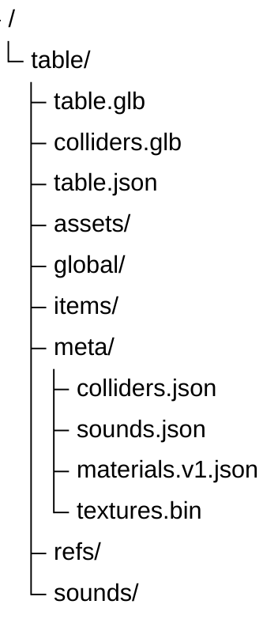

# Packaging

*This section explains the `.vpe` table format.*

A `.vpe` file is a ZIP container, split into a few layers with different jobs. We've tried using open and documented formats for most of it, but some data such as sidecar textures are stored in a way that allows more efficient loading. Basically, VPE is trying to solve two problems at once:

- package a table in a way that is compact and fast to load
- keep the package independent from any specific render pipeline

So, the scene itself lives in glTF. Gameplay and authoring metadata live in JSON. Material behavior that glTF cannot express cleanly is described in VPE's own vocabulary, with texture bytes stored separately when needed.

## Container Structure

The package looks like this at a high level:

| Part | Why it exists |
| --- | --- |
| `table.glb` | Carries the visible scene graph: hierarchy, transforms, meshes, lights, imported fallback materials, and textures that survive the glTF path cleanly. |
| `colliders.glb` | Carries meshes that exist for physics but are not naturally part of the visible glTF export. |
| `table.json` | Carries table-level metadata from `TableComponent.Metadata`. |
| `items/` | Carries component and item data needed to rebuild gameplay objects after the hierarchy exists. |
| `refs/` | Carries cross-references that can only be restored after all items and components are in place. |
| `global/` | Carries table-wide mapping data such as switches, coils, lamps, and wires. |
| `assets/` | Carries serialized `ScriptableObject` assets used by the table. |
| `sounds/` and `meta/sounds.json` | Carry sound bytes and the metadata needed to resolve them. |
| `meta/materials.v1.json` | Carries renderer-agnostic material intent for data that glTF does not express well enough for VPE. |
| `meta/textures.bin` | Carries packed texture bytes for VPE-owned textures referenced by `materials.v1.json`. |

## Materials

If glTF covered everything VPE needed, there would be no `materials.v1.json` and no `textures.bin`. In practice, glTF gets us a long way, but not all the way. Some authored material features are either renderer-specific, packed in ways glTF does not understand, or too fragile to trust to the fallback export/import path.

VPE therefore uses a layered approach:

- glTF carries what it already does well
- VPE captures the missing material intent in its own schema
- the active renderer in the player resolves that schema into real runtime materials

That design keeps the package from depending on HDRP, while still letting an HDRP-based player reconstruct the authored look closely.

For more details about how VPE's material abstraction, what glTF covers, what VPE adds, and what a renderer must implement, see [this page](materials.md).