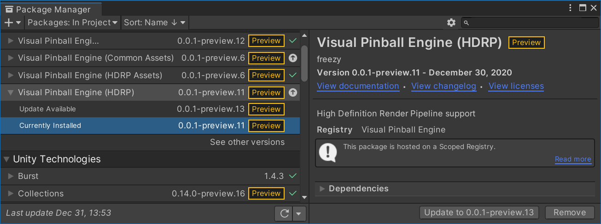
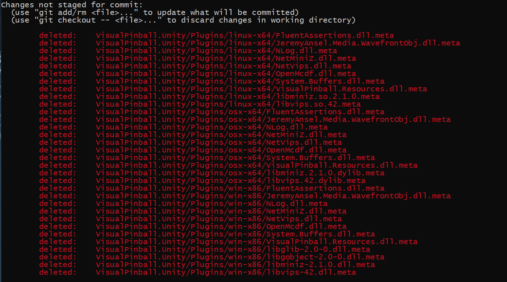

# Development Setup

VPE uses Unity's [Package Manager](https://docs.unity3d.com/Manual/upm-ui.html) to fetch its code. For users that's great because they get updates without having to deal with git, and the actual project to work with is very small because the heavy dependencies get pulled in by UPM. We use our [own scoped registry](https://registry.visualpinball.org/). Packages get published automatically when something gets merged or pushed to `master`.

However, packages are immutable in Unity, meaning code can't be updated and thus they are not suitable for local development. For that, you need to clone each package locally and manually add them to the project.

## Order of Setup

If you already have a project that references VPE through our registry, remove it. Then, clone all the repos:

```bash
git clone git@github.com:VisualPinball/VisualPinball.Unity.Assets.git
git clone git@github.com:freezy/VisualPinball.Engine.git
git clone git@github.com:VisualPinball/VisualPinball.Unity.Hdrp.git
git clone git@github.com:VisualPinball/VisualPinball.Unity.Urp.git
git clone git@github.com:VisualPinball/VisualPinball.Engine.PinMAME.git
```

If you receive authentication errors you will need to add an [ssh key to your github account](https://docs.github.com/en/authentication/connecting-to-github-with-ssh/adding-a-new-ssh-key-to-your-github-account).

Lastly, you'll need to compile some non-Unity dependencies:

```bash
cd VisualPinball.Engine
dotnet build -c Release

cd ..

cd VisualPinball.Engine.PinMAME
dotnet build -c Release
```

### HDRP

In your Unity project, add the repositories as package from disk in the following order:

1. [VisualPinball.Unity.Assets](https://github.com/VisualPinball/VisualPinball.Unity.Assets)
2. [VisualPinball.Engine](https://github.com/freezy/VisualPinball.Engine)
3. [VisualPinball.Unity.Hdrp](https://github.com/VisualPinball/VisualPinball.Unity.Hdrp)
4. [VisualPinball.Engine.PinMAME](https://github.com/VisualPinball/VisualPinball.Engine.PinMAME)

### URP

When working with URP, use these repositories in this order:

1. [VisualPinball.Engine](https://github.com/freezy/VisualPinball.Engine)
2. [VisualPinball.Unity.Urp](https://github.com/VisualPinball/VisualPinball.Unity.Urp)
3. [VisualPinball.Engine.PinMAME](https://github.com/VisualPinball/VisualPinball.Engine.PinMAME)

## Releasing

One advantage of UPM is that it makes it easy for users to upgrade:



In order for that to work, we use GitHub actions to increase the package version on each merge to master, publish the package to our registry and update the dependents. For example, if you commit to `vpe.assets`, GitHub will:

- Increase the version of `vpe.assets` and publish a new package to our package registry
- Update `vpe.assets.hdrp`, `vpe.assets.urp` and `main` to use the new version
- Since they got updated, the three repos in the last step will also increase their version and publish themselves

Summary: Committing to master on any repo will automatically release itself and its dependents. So avoid committing to master directly and use PRs!

## Cross-Repo Features

Sometimes you'll be working on features that span over multiple repositories. We recommend branching each repository to the same branch name so it's clear which branches belong together when testing the feature.

## .meta Files

Unity automatically creates a `.meta` file for every file and directory it indexes. It also does a somewhat decent job cleaning them up if the original file is missing. The `.meta` files are particularly important for native binaries, because they tell Unity to which platform they belong and thus avoid conflicts.

The thing is, in the main repo there are a few native dependencies which we don't include in the repo but rather reference them through NuGet and copy them to Unity's Plugin folder when compiling for the first time. That means that in the repo, we have the `.meta` files for those dependencies, but not the actual files, resulting in Unity cleaning the `.meta` files for all platforms when compiling.

Long story short, you'll end up with something like this very soon:



You don't want to commit this because it will break CI and package publishing. We also can't put them into `.gitignore` because that only applies to files that exist and you don't want to commit (here it's the other way around - you deleted files you don't want to commit).

The work-around is to tell git to explicitly ignore those files. You only do that once after cloning.

```bash
git update-index --assume-unchanged VisualPinball.Unity/Plugins/linux-x64/FluentAssertions.dll.meta
git update-index --assume-unchanged VisualPinball.Unity/Plugins/linux-x64/JeremyAnsel.Media.WavefrontObj.dll.meta
git update-index --assume-unchanged VisualPinball.Unity/Plugins/linux-x64/NLog.dll.meta
git update-index --assume-unchanged VisualPinball.Unity/Plugins/linux-x64/NetMiniZ.dll.meta
git update-index --assume-unchanged VisualPinball.Unity/Plugins/linux-x64/NetVips.dll.meta
git update-index --assume-unchanged VisualPinball.Unity/Plugins/linux-x64/OpenMcdf.dll.meta
git update-index --assume-unchanged VisualPinball.Unity/Plugins/linux-x64/System.Buffers.dll.meta
git update-index --assume-unchanged VisualPinball.Unity/Plugins/linux-x64/VisualPinball.Resources.dll.meta
git update-index --assume-unchanged VisualPinball.Unity/Plugins/linux-x64/libminiz.so.2.2.0.meta
git update-index --assume-unchanged VisualPinball.Unity/Plugins/linux-x64/libvips.so.42.meta
git update-index --assume-unchanged VisualPinball.Unity/Plugins/linux-x64/ICSharpCode.SharpZipLib.dll.meta
git update-index --assume-unchanged VisualPinball.Unity/Plugins/linux-x64/OpenMcdf.Extensions.dll.meta
git update-index --assume-unchanged VisualPinball.Unity/Plugins/osx/arm64/libvips.42.dylib.meta
git update-index --assume-unchanged VisualPinball.Unity/Plugins/osx/x64/libvips.42.dylib.meta
git update-index --assume-unchanged VisualPinball.Unity/Plugins/osx/FluentAssertions.dll.meta
git update-index --assume-unchanged VisualPinball.Unity/Plugins/osx/JeremyAnsel.Media.WavefrontObj.dll.meta
git update-index --assume-unchanged VisualPinball.Unity/Plugins/osx/NLog.dll.meta
git update-index --assume-unchanged VisualPinball.Unity/Plugins/osx/NetMiniZ.dll.meta
git update-index --assume-unchanged VisualPinball.Unity/Plugins/osx/NetVips.dll.meta
git update-index --assume-unchanged VisualPinball.Unity/Plugins/osx/OpenMcdf.dll.meta
git update-index --assume-unchanged VisualPinball.Unity/Plugins/osx/System.Buffers.dll.meta
git update-index --assume-unchanged VisualPinball.Unity/Plugins/osx/VisualPinball.Resources.dll.meta
git update-index --assume-unchanged VisualPinball.Unity/Plugins/osx/libminiz.2.2.0.dylib.meta
git update-index --assume-unchanged VisualPinball.Unity/Plugins/osx/libvips.42.dylib.meta
git update-index --assume-unchanged VisualPinball.Unity/Plugins/osx/ICSharpCode.SharpZipLib.dll.meta
git update-index --assume-unchanged VisualPinball.Unity/Plugins/osx/OpenMcdf.Extensions.dll.meta
git update-index --assume-unchanged VisualPinball.Unity/Plugins/win-x86/FluentAssertions.dll.meta
git update-index --assume-unchanged VisualPinball.Unity/Plugins/win-x86/JeremyAnsel.Media.WavefrontObj.dll.meta
git update-index --assume-unchanged VisualPinball.Unity/Plugins/win-x86/NLog.dll.meta
git update-index --assume-unchanged VisualPinball.Unity/Plugins/win-x86/NetMiniZ.dll.meta
git update-index --assume-unchanged VisualPinball.Unity/Plugins/win-x86/NetVips.dll.meta
git update-index --assume-unchanged VisualPinball.Unity/Plugins/win-x86/OpenMcdf.dll.meta
git update-index --assume-unchanged VisualPinball.Unity/Plugins/win-x86/System.Buffers.dll.meta
git update-index --assume-unchanged VisualPinball.Unity/Plugins/win-x86/VisualPinball.Resources.dll.meta
git update-index --assume-unchanged VisualPinball.Unity/Plugins/win-x86/libglib-2.0-0.dll.meta
git update-index --assume-unchanged VisualPinball.Unity/Plugins/win-x86/libgobject-2.0-0.dll.meta
git update-index --assume-unchanged VisualPinball.Unity/Plugins/win-x86/libminiz-2.2.0.dll.meta
git update-index --assume-unchanged VisualPinball.Unity/Plugins/win-x86/libvips-42.dll.meta
git update-index --assume-unchanged VisualPinball.Unity/Plugins/win-x86/ICSharpCode.SharpZipLib.dll.meta
git update-index --assume-unchanged VisualPinball.Unity/Plugins/win-x86/OpenMcdf.Extensions.dll.meta
git update-index --assume-unchanged VisualPinball.Unity/Plugins/win-x64/FluentAssertions.dll.meta
git update-index --assume-unchanged VisualPinball.Unity/Plugins/win-x64/JeremyAnsel.Media.WavefrontObj.dll.meta
git update-index --assume-unchanged VisualPinball.Unity/Plugins/win-x64/NLog.dll.meta
git update-index --assume-unchanged VisualPinball.Unity/Plugins/win-x64/NetMiniZ.dll.meta
git update-index --assume-unchanged VisualPinball.Unity/Plugins/win-x64/NetVips.dll.meta
git update-index --assume-unchanged VisualPinball.Unity/Plugins/win-x64/OpenMcdf.dll.meta
git update-index --assume-unchanged VisualPinball.Unity/Plugins/win-x64/System.Buffers.dll.meta
git update-index --assume-unchanged VisualPinball.Unity/Plugins/win-x64/VisualPinball.Resources.dll.meta
git update-index --assume-unchanged VisualPinball.Unity/Plugins/win-x64/libglib-2.0-0.dll.meta
git update-index --assume-unchanged VisualPinball.Unity/Plugins/win-x64/libgobject-2.0-0.dll.meta
git update-index --assume-unchanged VisualPinball.Unity/Plugins/win-x64/libminiz-2.2.0.dll.meta
git update-index --assume-unchanged VisualPinball.Unity/Plugins/win-x64/libvips-42.dll.meta
git update-index --assume-unchanged VisualPinball.Unity/Plugins/win-x64/ICSharpCode.SharpZipLib.dll.meta
git update-index --assume-unchanged VisualPinball.Unity/Plugins/win-x64/OpenMcdf.Extensions.dll.meta
git update-index --assume-unchanged VisualPinball.Unity/Plugins/android-arm64-v8a/FluentAssertions.dll.meta
git update-index --assume-unchanged VisualPinball.Unity/Plugins/android-arm64-v8a/JeremyAnsel.Media.WavefrontObj.dll.meta
git update-index --assume-unchanged VisualPinball.Unity/Plugins/android-arm64-v8a/NLog.dll.meta
git update-index --assume-unchanged VisualPinball.Unity/Plugins/android-arm64-v8a/NetMiniZ.dll.meta
git update-index --assume-unchanged VisualPinball.Unity/Plugins/android-arm64-v8a/NetVips.dll.meta
git update-index --assume-unchanged VisualPinball.Unity/Plugins/android-arm64-v8a/OpenMcdf.dll.meta
git update-index --assume-unchanged VisualPinball.Unity/Plugins/android-arm64-v8a/System.Buffers.dll.meta
git update-index --assume-unchanged VisualPinball.Unity/Plugins/android-arm64-v8a/VisualPinball.Resources.dll.meta
git update-index --assume-unchanged VisualPinball.Unity/Plugins/android-arm64-v8a/ICSharpCode.SharpZipLib.dll.meta
git update-index --assume-unchanged VisualPinball.Unity/Plugins/android-arm64-v8a/OpenMcdf.Extensions.dll.meta
git update-index --assume-unchanged VisualPinball.Unity/Plugins/ios-arm64/FluentAssertions.dll.meta
git update-index --assume-unchanged VisualPinball.Unity/Plugins/ios-arm64/JeremyAnsel.Media.WavefrontObj.dll.meta
git update-index --assume-unchanged VisualPinball.Unity/Plugins/ios-arm64/NLog.dll.meta
git update-index --assume-unchanged VisualPinball.Unity/Plugins/ios-arm64/NetMiniZ.dll.meta
git update-index --assume-unchanged VisualPinball.Unity/Plugins/ios-arm64/NetVips.dll.meta
git update-index --assume-unchanged VisualPinball.Unity/Plugins/ios-arm64/OpenMcdf.dll.meta
git update-index --assume-unchanged VisualPinball.Unity/Plugins/ios-arm64/System.Buffers.dll.meta
git update-index --assume-unchanged VisualPinball.Unity/Plugins/ios-arm64/VisualPinball.Resources.dll.meta
git update-index --assume-unchanged VisualPinball.Unity/Plugins/ios-arm64/ICSharpCode.SharpZipLib.dll.meta
git update-index --assume-unchanged VisualPinball.Unity/Plugins/ios-arm64/OpenMcdf.Extensions.dll.meta
```

Yeah, we know...