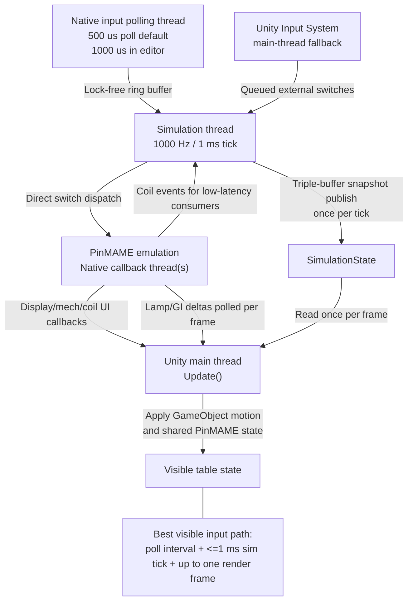
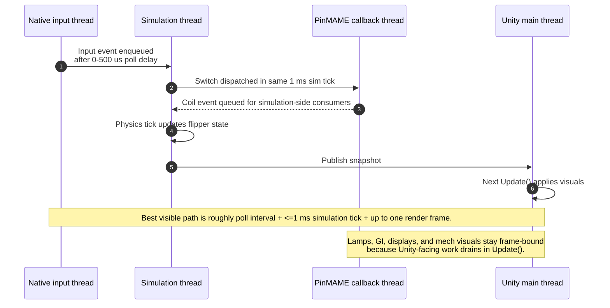

# Threading Model

VPE's low-latency runtime is intentionally split across several execution domains. The important point is that rendering and `GameObject` mutation stay on Unity's main thread, while physics simulation and time-sensitive game logic can run independently at a higher rate.

The current runtime architecture is built around four domains:

| Domain | Main code | What it does |
| --- | --- | --- |
| Unity main thread | `PhysicsEngine.Update()`, `SimulationThreadComponent.Update()`, `PinMameGamelogicEngine.Update()` | Applies visuals, drains queued callbacks, polls some PinMAME outputs, runs Unity APIs |
| Simulation thread | `SimulationThread`, `PhysicsEngineThreading.ExecuteTick()` | Runs the 1 kHz physics simulation loop, dispatches low-latency inputs, advances physics, publishes snapshots |
| Native input polling thread | `NativeInputManager`, `VisualPinball.Unity.NativeInput` | Polls keyboard input outside Unity's frame loop and forwards events into a lock-free ring buffer |
| PinMAME native callback thread(s) | `pinmame-dotnet` callbacks, `PinMameGamelogicEngine` handlers | Raises ROM-driven outputs such as coils, displays, mechs, audio, and state changes |

## High-level flow

## What each thread is responsible for

VPE supports two timing modes because the engine needs to serve two different runtime shapes. Internal timing is the simpler mode: Unity's main thread calls into physics directly, which keeps everything in one place and is easier to debug, integrate, and reason about when low latency is not the primary goal. External timing exists for the threaded runtime: it disables the normal `PhysicsEngine.Update()`-driven simulation step so a dedicated simulation thread can own the 1 kHz clock, feed PinMAME with tighter time fences, and react to inputs without waiting for the next frame. In short, internal timing optimizes for simplicity and compatibility, while external timing optimizes for determinism and lower end-to-end input latency.

### Unity main thread

The main thread remains the only place where Unity objects are touched directly.

- `PhysicsEngine.Update()` switches between single-threaded physics and external-timing mode.
- In external-timing mode it does **not** run physics. Instead it drains deferred callbacks, stages kinematic transform changes, and applies the latest published snapshot.
- `SimulationThreadComponent.Update()` keeps the simulation clock aligned with Unity time scaling, flushes any input dispatchers that require main-thread delivery, reads the latest snapshot, and applies shared PinMAME state such as lamps and GI.
- `PinMameGamelogicEngine.Update()` drains a main-thread dispatch queue for callbacks that cannot safely touch Unity from a native thread, then polls `GetChangedLamps()` and `GetChangedGIs()` once per frame.

This means that all visible motion is still frame-bound even when the simulation itself is running faster than the render loop.

### Simulation thread

`SimulationThread` creates a dedicated `Thread` named `VPE Simulation Thread` and runs it at `AboveNormal` priority. Its target cadence is 1000 Hz, or one tick every 1000 microseconds.

Each tick runs in this order:

1. Consume switch events that originated on the Unity main thread.
2. Consume native input events from the lock-free `InputEventBuffer`.
3. Dispatch low-latency coil outputs that PinMAME queued for simulation-side consumers.
4. Execute one physics tick through `PhysicsEngineThreading.ExecuteTick()`.
5. Advance the PinMAME time fence with `SetTimeFence()`.
6. Copy the current animation and shared-output state into `SimulationState` and publish the next snapshot.

Physics itself runs under `PhysicsLock`, but the published animation data crosses back to Unity through a triple-buffered `SimulationState` so the main thread can read it without taking that lock.

### Native input polling thread

When `SimulationThreadComponent` enables native input, `NativeInputManager` starts a native polling thread through `VisualPinball.Unity.NativeInput`.

- On Windows, the native code uses `GetAsyncKeyState()` in a dedicated highest-priority polling thread.
- The default poll interval is 500 microseconds, but the editor clamps it to 1000 microseconds to avoid destabilizing stop/start behavior.
- The native callback calls back into `NativeInputManager.OnInputEvent()`, which forwards the event straight into `SimulationThread.EnqueueInputEvent()`.

That path avoids waiting for Unity's next `Update()` before a flipper press becomes visible to the simulation.

Native polling does not replace Unity's Input System; the two paths coexist. `InputManager` still loads the Unity `InputActionAsset`, `SwitchPlayer` still listens to `InputSystem.onActionChange`, and those events still reach `Player.DispatchSwitch()` on the main thread. Native polling is the lower-latency path used when `SimulationThreadComponent` enables it, but it works with its own native binding table rather than reading Unity's `.inputactions` asset directly. The bridge between the two systems is the logical action name: `NativeInputManager` emits `NativeInputApi.InputAction` values such as `LeftFlipper` or `Start`, and `SimulationThread.BuildInputMappings()` maps those actions to actual game switches by scanning `IGamelogicEngine.RequestedSwitches` and matching each switch's `InputActionHint` against the same `InputConstants` names used by the Unity bindings. In other words, Unity and native input share the same action vocabulary, but they are configured through separate binding layers. That is why the native defaults in `NativeInputManager.SetupDefaultBindings()` are kept roughly aligned with the Unity defaults in `InputManager.GetDefaultInputActionAsset()`, and why the first switch advertising a given `InputActionHint` becomes the switch that native polling drives.

### PinMAME callback thread(s)

`pinmame-dotnet` registers managed callbacks in `PinMameApi.Config`. Those callbacks immediately invoke managed events from whichever native thread PinMAME uses for that callback.

VPE therefore treats PinMAME callbacks as **off-main-thread** work:

- display and mech updates are queued onto `_dispatchQueue` and drained later in `PinMameGamelogicEngine.Update()`.
- solenoid updates also enqueue normal Unity-facing callbacks onto `_dispatchQueue`.
- solenoid updates additionally enqueue low-latency coil events into `_simulationCoilDispatchQueue` when a coil can be handled safely from the simulation thread.
- lamp and GI changes are not delivered through the callback queue. They are polled on the Unity main thread once per frame with `GetChangedLamps()` and `GetChangedGIs()`.

This split is deliberate: coils can affect physics latency, while lamps and displays are primarily visual.

## Crossing thread boundaries

The runtime uses different mechanisms depending on how latency-sensitive the data is.

| From | To | Mechanism | Why |
| --- | --- | --- | --- |
| Native input thread | Simulation thread | `InputEventBuffer` lock-free SPSC ring buffer | Lowest-latency input path, no lock on the hot path |
| Unity main thread | Simulation thread | `SimulationThread` external switch queue | Lets Unity-driven switches join the 1 kHz simulation loop |
| Any thread | Physics thread/domain | `PhysicsEngine.InputActions` queue under `InputActionsLock` | Safe mutation requests into the physics state |
| Unity main thread | Simulation thread | `PendingKinematicTransforms` under `PendingKinematicLock` | Main thread observes transforms; sim thread consumes them |
| Simulation thread | Unity main thread | triple-buffered `SimulationState` | Lock-free animation/state handoff |
| Simulation thread | Unity main thread | physics `EventQueue` drained with `Monitor.TryEnter(PhysicsLock)` | Avoids stalling the main thread if simulation is mid-tick |
| PinMAME callback thread | Unity main thread | `_dispatchQueue` | Keeps Unity API usage on the main thread |
| PinMAME callback thread | Simulation thread | `_simulationCoilDispatchQueue` | Fast coil-to-physics path for flippers and similar devices |
| PinMAME shared output state | Snapshot / main thread | `_outputStateLock` + snapshot copy | Consistent lamp/GI/coil state across threads |

## Why the latency is lower than a frame-bound design

The key optimization is that the fastest input path does not wait for the next Unity frame.

In practice this creates two different latency classes.

### Low-latency path

This is the path for native input and simulation-thread-safe coil effects:

- Input can be detected by the native polling thread in well under a frame.
- The simulation thread sees it on the next 1 ms tick.
- PinMAME can emit a coil callback back into the simulation-side queue.
- Physics changes are published immediately into the next snapshot.

The remaining user-visible delay is usually waiting for Unity's next rendered frame to apply that snapshot.

### Frame-bound path

This is the path for visual-only and Unity-only work:

- Unity Input System input arrives on the main thread and then has to be queued into the simulation thread.
- Display, mech, and normal coil callbacks are drained on the next `PinMameGamelogicEngine.Update()`.
- Lamp and GI changes are only observed when the main thread polls PinMAME in `Update()`.

That work is still correct, but it is fundamentally tied to frame cadence rather than the 1 kHz simulation cadence.

## Important consequences and limits

- **Physics is Burst-compiled, not Job System-driven at runtime** - `PhysicsUpdate.Execute()` is Burst-compiled, but the runtime physics loop is called directly from the simulation thread or the Unity main thread. The live simulation path is not scheduled onto Unity worker threads through `IJob` or `IJobParallelFor`.
  That matters because the main concurrency boundary is *main thread vs dedicated simulation thread*, not Unity's runtime job scheduler.
- **Visible motion still waits for a frame** - Even with a 1 ms simulation tick, Unity transforms are only updated when the main thread applies the latest snapshot. Faster simulation reduces the time spent waiting for physics and ROM logic, but it does not bypass the render frame.
- **Some main-thread work is intentionally non-blocking** - `DrainExternalThreadCallbacks()` uses `Monitor.TryEnter(PhysicsLock)` instead of blocking. If the simulation thread is currently inside a physics tick, the main thread skips the drain and tries again next frame. That avoids hitches on the render thread, but it can delay callback delivery by one frame.
- **Catch-up is bounded** - `PhysicsUpdate.Execute()` caps catch-up work through `PhysicsConstants.MaxSubSteps`. Under heavy load, VPE prefers dropping excess catch-up rather than letting a long stall cascade into even worse latency.
- **PinMAME shutdown avoids blocking Unity** - PinMAME stop can block while the native emulator thread joins, so `PinMameGamelogicEngine` pushes shutdown work onto `Task.Run()` instead of doing it on Unity's main thread.

## Practical guidance for contributors

- If code touches `GameObject`, `Transform`, or other Unity APIs, keep it on the main thread.
- If code changes the authoritative simulation state, decide whether it belongs in the simulation thread or should be queued into physics through `PhysicsEngine.Schedule()`.
- If a PinMAME callback must influence physics immediately, prefer the simulation-thread coil path instead of a main-thread callback.
- If a feature is visual-only, it is usually acceptable for it to stay frame-bound.
- If you add another game logic engine, implement `IGamelogicInputThreading`, `IGamelogicTimeFence`, `IGamelogicCoilOutputFeed`, or shared-state interfaces only when the engine is actually safe to use from those domains.
