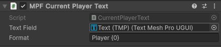
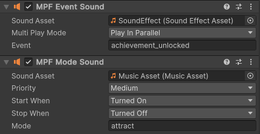
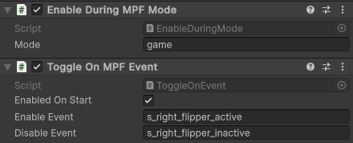

> [!NOTE]
>
> The VPE media controller is very basic compared to the fully featured Kivvy
> and Godot based media controllers by the MPF developers.

# Media Controller

MPF is designed with real pinball machines in mind and those typically have a
specialized circuit board for controlling the playfield hardware. To allow MPF
to control your virtual playfield, VPE connects to MPF as if it was a stupid
little circuit board that can do nothing but turn coils and lights on and off.
As a result, MPF only gives simple orders to VPE without providing any
information about the larger context within the current game, like what modes
are active, how many players there are, or even what the score is. To get this
information, VPE connects to MPF through a separate channel designed for
controlling the displays and speakers in the backbox.

## Text

To display variables from MPF (such as the current player's score) in a text
field, you can use one of the following components:

- **MPF Current Player Text** shows the number of the player whose turn it is.
- **MPF Player Count Text** shows the number of players in the current game.
- **MPF Machine Variable Text** and **MPF Player Variable Text** show machine
  and player variables, respectively. For technical reasons, they each have
  three variants:
  - **String** for text variables including symbols other than numeric digits
  - **Int** for whole numbers
  - **Float** for decimal numbers

You can find these components under _Pinball -> MPF Media Controller_ in the
_Add Component_ menu. Each component needs a text field to show the text. To
create one, right-click in your hierarchy and select _UI -> Text - Text Mesh
Pro_. If prompted, import the TMP Essential Resources, then drag the game object
of the newly created text field into the _Text Field_ box on the MPF text
component. To learn about positioning and styling text fields and other UI
elements, refer to the
[Unity documentation](https://docs.unity3d.com/Packages/com.unity.ugui@latest).

### Formatting

By default, the text field will display the variable as it was received from
MPF, but you can optionally specify a format string to customize how the value
from MPF is converted to text. The most basic way to use this feature is to add
additional text before or after the variable. For example, enter `P{0}` into the
_Format_ field of an _MPF Current Player Text_ component to prefix the player
number with the letter 'P.' Using more advanced format string features, it is
possible to separate every third digit of the score number with a comma or round
to a certan number of decimal places. You could learn how to do that and much
more in
[Microsoft's introduction to string formatting in .NET](https://learn.microsoft.com/en-us/dotnet/fundamentals/runtime-libraries/system-string-format#get-started-with-the-stringformat-method).
Or you could take the easy route and just ask some LLM to write your format
strings for you.

## Sound

<!--
The text is shorter than the image on big screens. Make sure the next section
doesn't start next to the image to avoid layout conflicts with the second image.
-->

To play a sound effect when the player unlocks an achievement or to add a
soundtrack for a specific mode, use the _MPF Event Sound_ and _MPF Mode Sound_
components. Each one allows you to specify the name of an event or mode from MPF
and a sound it should trigger. _MPF Mode Sound_ has additional options for
stopping the sound that are useful for music.

## Toggling Objects

VPE's media controller can enable and disable game objects in the Unity scene
whenever events occur or modes are triggered in MPF. While it is a far cry from
what is possible with MPF's new Godot based media controller, this feature
allows you to at least show and hide some graphics or videos when things happen
in MPF without having to split your table across two game engines.

The _Enable During MPF Mode_ component enables its parent object during the
specified MPF mode and disables it otherwise. The _Toggle On MPF Event_
component enables its parent object when the _Enable Event_ occurs and disables
it when the _Disable Event_ occurs. You do not have to specify both. If both are
set to the same event, that event will enable the object if it is disabled and
enable it when it is disabled. The MPF documentation contains a
[list of all events built into MPF](https://missionpinball.org/latest/events/).
In addition, you can define your own.

Lastly, make sure the objects you add these components to are intially enabled.
They cannot begin receiving events until their parent object is enabled. If the
object should be disabled initially, do not just disable it in the scene. For
objects controlled by a _Toggle On MPF Event_ component, use its _Enabled On
Start_ checkbox. Objects with an _Enable During MPF Mode_ component will always
be disabled on startup, at least until MPF starts the first mode.
