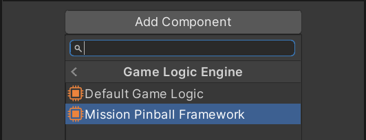

# Setup

## Prerequisites

Future plans include shipping MPF entirely with Unity, but currently, you need to have MPF locally installed on your machine. You can do that quite easily by:

1. [Installing Python 3.7](https://www.python.org/downloads/)
2. `pip install --pre mpf mpf-mc`

You can *upgrade* MPF if you already have installed it by running:

```bash
pip install mpf mpf-mc --pre --upgrade
```

You'll need at least MPF v0.55.0-dev.12.

## Unity Setup

Mission Pinball Framework integration comes as an UPM package. In Unity, add it by choosing *Window -> Package Manager -> Add package from git URL*:

<p></p>

Then, input `org.visualpinball.engine.missionpinball` and click *Add* or press `Enter`. This will download and add MPF to the project. You can test if it was successful by selecting your table node in the hierarchy, click *Add Component* and select *Visual Pinball -> Gamelogic Engine*. This should display the *Mission Pinball Framework* gamelogic engine.

<p></p>

> [!NOTE]
> You will need to have our scoped registry added in order for Unity to find the MPF package. How to do this is documented in the [general setup section](/creators-guide/setup/installing-vpe.html).