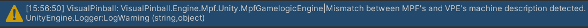

# Usage

MPF support is implemented as a
[Gamelogic Engine](../../creators-guide/manual/gamelogic-engine.md). It's a
[Unity Component](https://docs.unity3d.com/Manual/Components.html), so all you
have to do is add it to the root
[GameObject](https://docs.unity3d.com/Manual/GameObjects.html) of your table. To
do this:

1. Select the table in the hierarchy
2. Click _Add Component_ in the inspector
3. Select _Visual Pinball -> Game Logic Engine -> Mission Pinball Framework_.

If there is already another game logic engine component attached, remove it.
_There can be only one._

## The machine folder

All files that MPF needs to run your table are contained in the so-called
[_machine folder_](https://missionpinball.org/latest/tutorial/2_creating_a_new_machine/).
When the package is first installed, it will create a default machine folder in
the `Assets/StreamingAssets` directory of your Unity project. This folder is
already set up for use with VPE and contains the necessary configuration to
allow MPF to drive the default VPX 'blank' table. This is all you need to know
to get started, but if you are serious about creating a table using MPF, you
should learn how to use it. The best way to do that is to follow the
[official MPF tutorial](https://missionpinball.org/latest/tutorial/).

## Retrieve machine description

> [!NOTE]
>
> While VPE could read the MPF machine config itself, we let MPF handle it. That
> means we run MPF with the given machine config and then query its hardware.
> While this is a bit slower, it has the advantage of coherent behavior between
> edit time and runtime, and doesn't add an additional maintenance burden.

Since the game logic engine is the part of VPE that provides switch, coil, and
lamp definitions so VPE can link them to the table during gameplay, you'll need
to retrieve them from MPF. You can do this by clicking _Get Machine Description_
in the MPF component's inspector. This will save it to the component. You will
only need to do this once unless you update the MPF machine config. Visual
Pinball Engine compares its stored machine description with the one used by MPF
every time you start the game. Look out for this warning in the Unity Console:

## Wire it up

Now that VPE knows which switches, coils, and lamps your machine expects, you'll
need to connect them using the
[switch](../../creators-guide/editor/switch-manager.md),
[coil](../../creators-guide/editor/coil-manager.md), and
[lamp manager](../../creators-guide/editor/lamp-manager.md).

You can watch the entire process in a quick video here:

> [!NOTE]
>
> The MPF integration package has been updated since the recording of this
> video, so the user interface will look different for you, but the process is
> still the same.

> [!Video https://www.youtube.com/embed/cdzvMUpdDgs]
