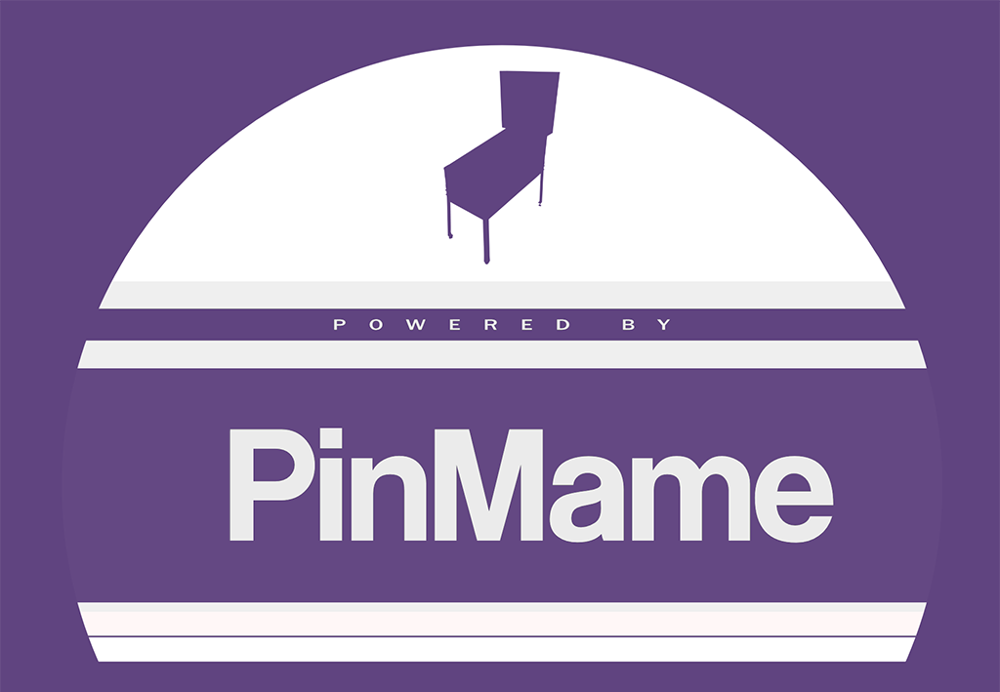

# PinMAME

PinMAME emulates the hardware found in almost every solid state pinball machine created from the mid 1970s through 2014. Originally forked from [MAME](https://www.mamedev.org/), it has since relentlessly been updated with bugfixes, new games, and new features.

VPE uses [pinmame-dotnet](https://github.com/vpinball/pinmame-dotnet) to emulate game logic of recreations. Pinmame-dotnet is a wrapper around `libpinmame`, which is a native and cross-platform build of PinMAME. It's significantly faster than the COM interface that Visual PinMAME (VPM) is using.

## ROMs

The game code running on PinMAME's emulated hardware (also called "ROM"), does not ship with PinMAME and needs to be obtained separately. Note that ROMs are copyrighted software and should only be used by owners of the original game.

## License

PinMAME still partly runs under the [MAME license](https://github.com/vpinball/pinmame/blob/master/LICENSE), which prohibits commercial usage. While the source code of this plugin is licensed under MIT, it still links to and ships with PinMAME, so the MAME license must be honored as well.