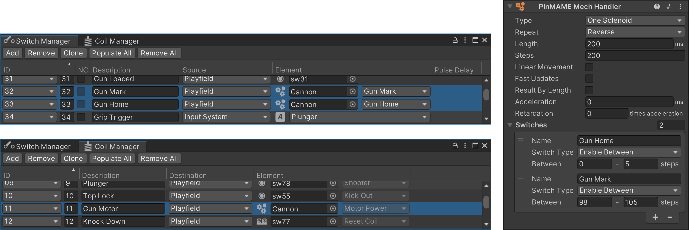

# PinMAME Mech Handlers

A pinball table contains many mechanisms that interact with the ball. Classic examples are the flippers, kickers, or the trough. However, when we refer to *PinMAME Mechs*, we refer to very specific mechanisms involving a motor, usually toys of some sort.

Mechs come in all forms and complexities. Some like the pole dancers in the Sopranos are for show only, while many others serve a very specifc purpose during gameplay. A few more examples are Rudy's eyes in Funhouse, the cannon in Terminator 2, the glove in Johnny Mneumonic which has full player control, or the spinning wheels in Whirlwind.

To understand how PinMAME handles mechs, a bit of history is needed. Before there even was PinMAME (it was called WPCMAME at the time, because it would only emulate WPC games), the dev team needed some way to "play" the game so they could check the sounds and the animations of the ROM.

So what they did is they wrote a *simulator* that would close and open switches at the appropriate times to fool the game into thinking everything works as designed. For example, when T2's cannon is rotating and you push the fire button, it would literally calculate the position of the gun and which drop target the ball would hit and enable the switch of that target after a short delay. Of course, PinMAME doesn't include a physical simulation that includes geometry and gravity and such, so the simulation of the ball trajectory was quite approximative.

Then came along Visual Pinball, and "physical" simulation was not needed anymore. However, *some* calculations done by PinMAME's simulator were still of interest. Let's take again T2's cannon. The game starts the motor, which will then start rotating the cannon. At certain rotation angles, a physical switch tells the game how far the cannon has rotated. There is also an end position at which the movement changes direction, rotating the cannon back in the opposite direction.

Just for knowing the rotation angle of the cannon there's a lot of math and timing involved. That's why PinMAME offers a way to provide the result of these calculations back to Visual Pinball with the `GetMech()` API. In the table script, you would tell PinMAME which mechs to simulate and regularly retrieve the result in order to just update the rendered elements on the playfield. Switches and coils involving the mech would also be handled by PinMAME.

However, this worked only for a handful of fully simulated WPC games, and even for those, parameters needed to be tweaked, which was impossible with this approach. So something more generic was needed. And this finally brings us back to our original topic: *Custom mechs handlers*, or **PinMAME Mech Handlers** as we call them. They work like the internal simulation, but can be configured through an API.

To sum it up, in *Visual Pinball*, there are three approaches today to deal with mechs:

1. Use PinMAME's internal simulation. Nearly never used.
2. Configure a custom mech handler. Occasionally used.
3. Use timers and handle everything in the table script. The most common approach.

This page is about 2. and describes how you can configure and use PinMAME mech handlers in VPE.

> [!note]
> Some toys like High Roller Casino's slot machine toy are too complex to be simulated with a PinMAME mech handler. Understanding how the toy works is key here. We will try our best to provide components that are able to cover most of your mech needs.

## Setup

PinMAME can simulate up to five custom mechs. You create one by adding the *PinMAME Mech* component onto a game object. 

> [!note]
> If you come from Visual Pinball, this component has the same function as the `cvpmMech` class in `core.vbs`.

### Type

This defines how the mech is controlled. There are four options:

- *One Solenoid* - The motor turns into one direction only, and the solenoid turns it on and off. Example: Sopranos pole dancers.
- *One Directional Solenoid* - Two solenoids, one for enabling the motor, one for setting the direction. Example: The cannon in T2.
- *Two Directional Solenoids* - The first solenoid controls clockwise movement and the second solenoid controls counter-clockwise movement. Example: The soccer ball in World Cup Soccer '94.
- *Two Stepper Solenoids* - Two solenoids that control a stepper motor. Example: Drag strip cars in Corvette.
- *Four Stepper Solenoids* - Four solenoids that control a stepper motor. Only the first solenoid is defined and PinMAME assumes that the three remaining solenoids are the following coil numbers.

### Repeat

How the mech behaves when the end of the range of motion is reached. There are three options:

- *Circle* - Loops, i.e. starts the motion again from the beginning.
- *Reverse* - Reverses the direction, i.e. moves back to the beginning.
- *Stop at End* - Automatically stops when the end has reached.

### Length 

The length is the amount of time, in milliseconds, that the specified solenoids must be enabled for, to move a single step in the progression from the start to end position. It indirectly defines the speed.

### Steps

This is the total number of steps from the start to the end position. Every time a new step is reached the mech is updated with a new value.

### Movement, Speed and Output Value

- Check *Linear Movement* (default) if you need to simulate a linear movement, as opposed to non-linear movement.
- Check *Fast Updates* if the calculations should be updated at 240Hz, as opposed to 60Hz (default).
- Check *Result By Length* if you want the result to be based on the length, as opposed to the number of steps (default).

### Acceleration and Retardation

By default set to 0, *acceleration* defines the amount of time in milliseconds required to reach full speed, while *retardation* defines the time required to come to a stop, *in relation to acceleration*. For example, setting of `Acceleration = 50` and `Retardation = 0.2` corresponds to 50ms to reach full speed and comes to a stop 10ms after the solenoid turns off. Both values are 0 per default.

### Switches

A PinMAME mech can handle up to 20 switches. Depending on the type, they have different behavior and different parameters:

- A switch set to *Enable Between* will be closed by PinMAME when the mech position is between a range of defined steps.
- A switch set to *Always Pulse* is constantly closed and opened when the motor is running. You configure the frequency and the duration it stays closed.
- A switch set to *Pulse Between* is pulsed for one step with a configurable frequency during a range of steps.

> [!note]
> If you come from Visual Pinball, *Enable Between* corresponds to `AddSw`, *Always Pulse* to `AddPulseSw`, and *Pulse Between* to `AddPulseSwNew`.

### Switch and Coil Assignments

As described above, a mech comes with a least one solenoid and up to 20 switches. In order to tell PinMAME which solenoid to listen to and which switches to trigger, we use the [Coil Manager](xref:coil_manager) and the [Switch Manager](xref:switch_manager).

Here is an example configuration that drives the gun in T2:

<small>*Here, the PinMAME Mech Handler sits on a game object named "Cannon".*</small>

> [!note]
> The reason VPE uses the managers to assign the right number (as opposed to let you specify it directly in the component) is that everything switch or coil related is at one place, and that the same principle can be re-used for other GLEs or components.

### Runtime

During gameplay, PinMAME executes callback for each mech with the current step position.