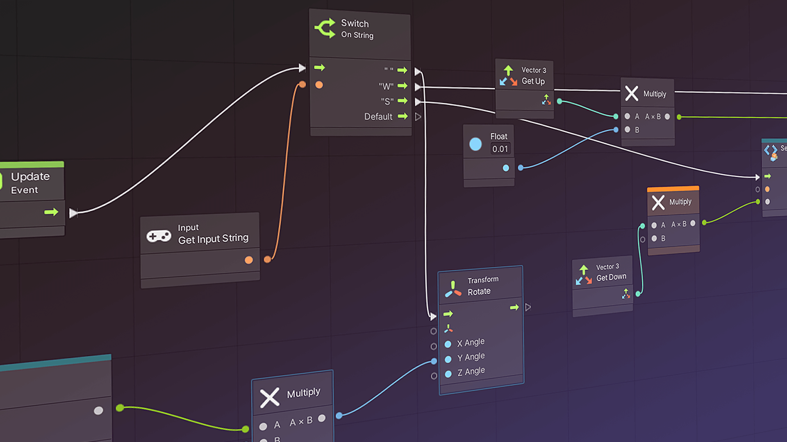

# Visual Scripting

Unity has a powerful [visual scripting](https://unity.com/products/unity-visual-scripting) feature that VPE leverages for creating game logic without having to write code. It uses a node system which VPE extends to significantly simplify common tasks in a pinball game.

> [!note]
> Visual scripting was previously named *Bolt*, and was a commercial product in Unity's asset store. In 2020, [Unity acquired Bolt](https://ludiq.io/blog/unity-acquires-bolt) and made it freely available.

## Why?

VPE provides many tools that help you create pinball games. Our goal is to make it as easy as possible, so also non-technical people can pour their creativity into making original games.

Looking at Visual Pinball, which uses VBScript for not only the game logic but also all the physical logic, people often ask which scripting language VPE will use. We don't have an answer to that yet. While Unity uses C#, and you can code whatever you want with it, there are a few obstacles that we need to overcome before recommending C#, namely:

- **APIs** - The VPE code base is quite large, and we haven't put any effort into declaring which of the interfaces are internal and which are public. This is important, because internals can be changed and refactored in future updates, while public interfaces must stay the same in order not to break backwards compatibility. Thus, these APIs need to be well defined and documented.
- **Compilation** - Unlike VBS, C# is technically not a [scripting language](https://en.wikipedia.org/wiki/Scripting_language) but needs to be compiled. With VPE being cross-platform, this is problematic when shipping in a modding-friendly format. Additionally, Unity's [AssetBundles](https://docs.unity3d.com/Manual/AssetBundlesIntro.html) don't allow assemblies to be included, so we'll need a way of working around that as well.

Visual scripting doesn't have the above problems. It doesn't need to be compiled, and the VPE APIs are the nodes that we provide.

> [!note]
> Personal note: As software developers, we're obviously sceptical about anything that is supposed to replace code. So we started implementing an EM game in visual scripting. After putting some effort into creating the right kind of nodes to bring down the graph size significantly, we're happy and we think it's an awesome way of creating game logic.

## How?

If you're coming from Visual Pinball, you're probably used to doing everything in VBScript, including physics hacks and transforming objects on the playfield. VPE is different in that it separates the physical aspect of the table from the logical part (the "game logic"). We use visual scripting exclusively as a [Gamelogic Engine](xref:gamelogic_engine).

This approach already reduces a lot what visual scripting must be able to do. It basically boils down to triggering coils and lamps based on switch events. Of course there are a few more things like updating the display and for more complicated games, triggering entire light shows and sounds, but in a nutshell it's very simple.

For more details about visual scripting in general, check out [Unity's documentation](https://docs.unity3d.com/Packages/com.unity.visualscripting@1.8/manual/index.html). You will learn about [graphs](https://docs.unity3d.com/Packages/com.unity.visualscripting@1.8/manual/vs-graph-types.html), and about [script and state machines](https://docs.unity3d.com/Packages/com.unity.visualscripting@1.8/manual/vs-graph-machine-types.html).

## Installation

Visual scripting comes as an UPM package. In Unity, add it by choosing *Window -> Package Manager -> Add package from git URL*:

Then, input `org.visualpinball.engine.unity.visualscripting` and click *Add* or press `Enter`. This will download and add visual scripting to the project. 

> [!NOTE]
> You will need to have our scoped registry added in order for Unity to find the visual scripting package. How to do this is documented in the [general setup section](/creators-guide/setup/installing-vpe.html#vpe-package).

Once the visual scripting package is install, you can [set up](xref:uvs_setup) the gamelogic engine for it.