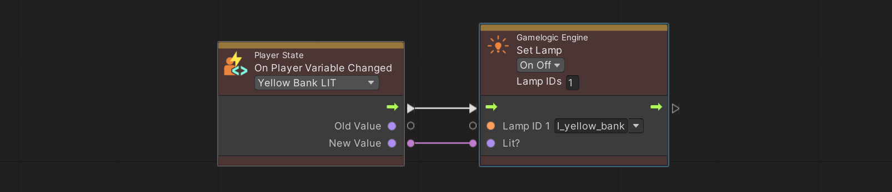
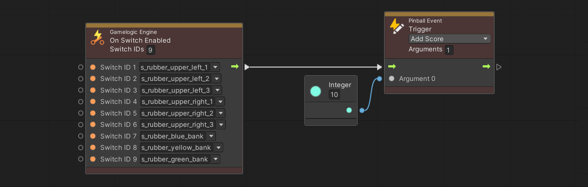

# Node Reference

This page details all the VPE-specific nodes that we have created for visual scripting.

You can recognize VPE nodes easily by their color; they are orange. When creating new nodes, VPE event nodes can be found under *Events/Visual Pinball*, and other nodes simply under the root's *Visual Pinball*.

Besides the simple read/write/event nodes, there are a bunch of nodes that solve common patterns in pinball games. While you could implement the same logic using Unity's standard nodes, we recommend using those custom nodes, because they save you space and thus increase the readability of your graphs.

However, it's hard to use them without knowing about them, so we recommend reading through this page in order to familiarize with them.

## Coils

### Set Coil

This node assigns a given value to one or multiple coils, and keeps that value. This is useful when both the *enabled* and *disabled* status are important. Otherwise, use the [*Pulse Coil*](#pulse-coil) node, which enables a coil, and automatically disables it after a short delay.

A typical use case for this node is linking the flipper coil to a switch event. Here an example of a game that has an upper flipper and a lower flipper, both linked to the same *left flipper* switch.

As seen in the screenshot, you can set the number of affected switches in the header of the node. Increasing the number will add additional ports below.

### Pulse Coil

This node enables one or multiple coils, and disables them after a given delay. This is useful when you only care about the "enabled" event, which often the case. Here an example of the eject coil of the trough being pulsed when the *running* state is entered.

## Switches

### On Switch Enabled

This is probably the most common switch event you'll use. It triggers when any switch of a list of switches is *enabled*.

Here is an example of the drain switch increasing the *current ball* variable.

### On Switch Changed

The other switch event triggers in both cases, when the switch is enabled, and when it gets disabled. The classic example already mentioned above are the flipper buttons.

When using multiple switches, you'll get an event for any of the switches with the value of the switch that changed.

### Get Switch Value

This node just returns the current switch value of a given switch. While usually you should rely on player and table variables for saving and retrieving status, it still has its usage. For example, you might want to not add the state of a kicker to the variables and rely on the kicker switch directly instead.

You can also add multiple switches, in which case the output is only true if *all switches* are enabled.

## Lamps

Lamps a bit more complex than coils and switches, because besides of simply being *on* or *off*, they have an *intensity* and a *color*. Additionally, they can be set to a *blinking* state. This means that all our lamp nodes include a dropdown indicating how it should be driven, with the port types changing accordingly:

- **Status** corresponds to a `enum`, one of  *On*, *Off* and *Blinking*.
- **On/Off** is a `boolean`, where `true` corresponds to the *On* status, and `false` to the *Off* status.
- **Intensity** corresponds to a `float`, and is explained in more detail below.
- **Color** has its own `Color` type.

These four modes allow you to completely control a lamp (with *On/Off* being sugar for setting the status using a `boolean`). However, there is a second factor that defines how the lamp will actually react, and that is its [mapping type](xref:lamp_manager#type) in the lamp manager.

See, VPE supports a wide range of gamelogic engines, and they often don't have an internal API as rich as our visual scripting package. For example, when PinMAME sets a light to the value of 255, it doesn't know whether it just "turned it on" from 0 or whether it was "faded in" from a previous non-0 value. That's information we have to manually set in the lamp manager (in this example, the mapping type would be *Single On|Off* and *Single Fading* respectively).

That said, the only mode that might leads to confusion is *Intensity*, mainly because it's the only value that PinMAME emits. So if you choose *Intensity*, here is how the value is treated depending each mapping type:

- *Single On|Off* sets the **status** of the lamp to *On* if the value is greater than 0, and to *Off* otherwise.
- *Single Fading* sets the **intensity** to the value *divided by [maximal intensity](xref:lamp_manager#max-intensity)*. We recommend setting the maximal intensity to 100 in the lamp manager and use values from 0 to 100 in the visual scripting nodes.
- *RGB* sets the **intensity**, where the value is between 0 and 1.
- *RGB Multi* you probably won't use. It sets the [channel](xref:lamp_manager#channel) defined in the mapping to the value divided by 255 (yes, it's very PinMAME specific).

> [!NOTE]
> When creating your proper game logic, you should rely on [variables](#variables) instead of lamp status in your logic. However, since you can also use visual scripting along with different gamelogic engine such as [PinMAME](xref:pinmame_index), where you can't access the internal state, we also provide nodes for lamp events and retrieving their value.

Let's jump to the nodes.

### Set Lamp

This node assigns a given value to a lamp defined by its mapped ID. This also triggers the lamp changed event. 

In the example, we have defined a player variable of type `boolean` called *Yellow Bank Lit*. We synchronize the lamp status with the variable by setting the lamp with the ID `l_yellow_bank` to the value of the variable when it changes.

## Variables

See [Variables](xref:uvs_variables) for an overview on how variables work. We will be using examples for player variables, but apart from [creation](#create-player-state) and [changing](#change-player-state), they work the same way as table variables.

### Create Player State

This node adds variables for a new player. If the game starts and you want to use player variables, you need to create a player state, even if your game has only one player. 

You would typically do it when the game starts. Multiplayer games would execute this node when *start* is pressed during the first ball.

This node has the following options:

- **Auto-Increment** automatically sets the player ID. It does that by increasing the largest existing player ID by one.
- **Player ID** is only visible if auto-increment is not set, and lets you specify the player ID.
- **Set as Active** will make the newly created player state the current state. This makes sense when a new game is started, but not when new players are added.
- **Destroy Previous** deletes all player states before creating the new one. This is useful when starting a new game.

Here an example of the player state being created right after the state machine enters the game state, i.e. when the game starts.

> [!note]
> This one of two nodes that doesn't exist for table variables.

### Change Player State

This nodes swaps out the current player variables with the ones from another player. You do this when a player has finished playing and it's the next player's turn.

The following options are available:

- **Next Player** automatically choses the next player. If the current player is the last player, the next player is the first player. You typically enable this option when using *auto-increment* during player state creation. It means that VPE handles the player IDs.
- **Player ID** lets you explicitly set the ID of the player you want to change to (only visible of *Next Player* is disabled).

The following is an example of a multiplayer game with infinite balls (i.e. remaining balls are not checked). The flow starts with the drain switch, which then checks whether the current player has any extra balls left. If that's not the case, then the player state is changed to the next player, otherwise the number of extra balls is decreased instead, and finally the eject coil of the trough is pulsed.

> [!note]
> This the second node that doesn't exist for table variables.

### Get Player ID

This node gives you access to the player ID. There are three different modes:

- *Current* returns the ID of the current player
- *First* return the smallest player ID
- *Last* returns the largest player ID

A typical example is shown in the [next section](#get-variable).

### Get Variable

This node returns the value of a given variable. To build on the previous example, let's do a check whether we should end the game if a ball was drained.

To do that, we retrieve the player variable *Current Ball Number* and check if it's the same as the global variable *Balls per Game*. If that's the case, we assume that it's the last ball. Then we compare the current player ID to the last player ID. The final *And* node checks if both conditions are true, and what comes out is whether we should end the game or not.

### Set Variable

This node applies a given value to a variable. It's very straightforward. Here an example of a trigger enabling the lit status of a bumper.

### Increase Variable

More often than not, you want to increase a variable by a given value rather than setting an absolute value. This node does exactly that, for integer and float typed variables. For string types, it concatenates the value to the current one. For boolean types, it inverts the current value, *if* the input value is `true`.

A typical example for this node is scoring. This example adds 1000 points to the score when the bumper switch is enabled.

### On Variable Changed

One of the main advantages of using VPE's variable system is that you get events when they change. That makes it easy to separate how the variable is updated from what effect updating it causes. That's great, because you shouldn't care *why* a variable was updated, only *when* and *to which value* (see also [Synchronizing State](xref:uvs_variables#synchronizing-state)).

In this example, we listen to the score variable and fetch it into our *Update Display* node, which sends the data to our score reel component, which then rotates the reels accordingly. Note that you'll also get the previous value of the variable, before it changed.

## Events

### Trigger Pinball Event

This node triggers an event that was previously defined in the inspector of the visual scripting gamelogic engine. It can be fed with an arbitrary number of arguments.

In this example we don't set the score directly but emit an event so we can have a centralized logic dealing with scores (it's for an EM, and while the reel motor is on, no scoring is skipped):

### On Pinball Event

On the receiving end, this is the event node that is triggered when a pinball event node with the same event is executed. To continue the previous example, here a graph triggered by a pinball event, which updates the score if the score reel motor is not running.

