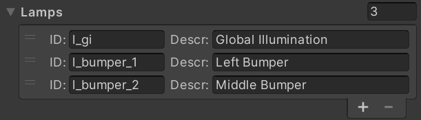
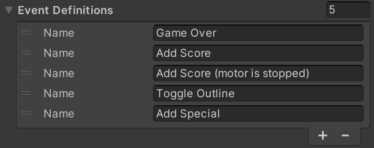

# Setup

In order to use visual scripting as your gamelogic engine, you need to add it as a component to your table. In order to do that, navigate in your hierarchy to the root node of your table, where you most likely still have the *Default Gamelogic Engine* added. If that's the case, remove it by clicking on the three dots and choose *Remove Component*. 

Then, add the visual scripting GLE component by (still in the inspector) clicking on *Add Component -> Visual Pinball -> Gamelogic Engine -> Visual Scripting Game Logic*.

## Configuration

Remember that a [gamelogic engine](xref:gamelogic_engine) doesn't know about your playfield. It communicates with the game through IDs that you assign in editor. We acknowledge that visual scripting is tied somewhat more closely to the playfield than, let's say, PinMAME, because it's equally created in the editor. However, there are multiple reasons to use the same pattern as in other GLEs, which is what visual scripting does.

So instead of interacting with playfield items directly, you need to define the displays, switches, coils and lamps in the visual scripting component. Once added, you can link them with the respective editors to the playfield.

### Displays

The first configuration you'll see in the inspector is which type of displays your game expects to find on the playfield. You can have multiple displays. For each display, you define the size and which type of formats it must able to handle. These are the possible types:

- *DMD2, DMD4, DMD8 and DMD24* is pixel data, where the number is the number of bits:
  - 2, 4 and 8 bits equal 4, 16 and 256 respectively gray tones
  - 24 means RGB24, standing for 16mio colors.
- *Segment* are segment displays, which take in an array of binary data, where each two bytes represent the segments of one digit.
- *Alphanumeric* are displays that can render text on one line.
- *Numeric* displays only render digits.

The display components that VPE provides understand multiple formats, e.g. our segment display component takes in segment data, but also text and numeric data. In the future, we'll also add a simple numeric and text renderer for DMDs.

### Switches

In this section you define the switches that appear in the [Switch Manager](xref:switch_manager) when you auto-populate them. It's also the source for all the [switch-related nodes](xref:uvs_node_reference#switches) that VPE provides within your visual scripting graphs.

### Coils

Here you define your coils. Same concept as for switches. These are the coils you'll see in the [Coil Manager](xref:coil_manager), and they are the source when looking up IDs in visual scripting's [coil nodes](xref:uvs_node_reference#coils).

### Lamps

Same goes for the lamps. They appear in the [Lamp Manager](xref:lamp_manager) and are used in the [lamp nodes](xref:uvs_node_reference#lamps) that VPE provides.

It's worth noting that VPE currently doesn't provide any tools for creating light shows. Once we do, we'll provide additional lamp nodes to trigger and blend them together.

### Events

Unity provides [Custom Events](https://docs.unity3d.com/Packages/com.unity.visualscripting@1.7/manual/vs-events-reference.html#custom-events) which allow you to globally pass data across graphs. While this is a valid approach, VPE provides its own event nodes called *Pinball Events*, which allow you to declare your events. This has the benefit of being able to simply pick an event from a drop-down when configuring the nodes, as opposed to having to remember or separately document existing event names.

### Variables

It's worth describing variables more in detail, which we do in the [next section](xref:uvs_variables).