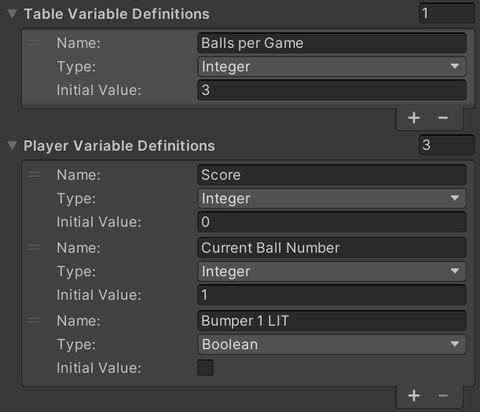
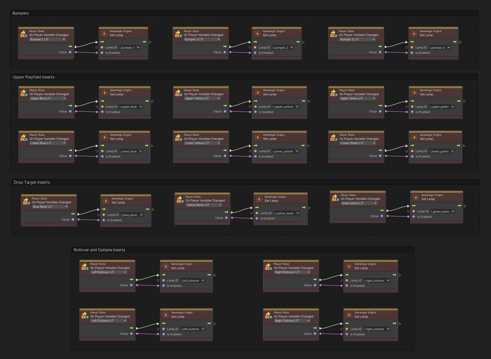

# Variables

As you create your game logic, you'll want to read and write data such as the player's score, or the number of balls per game. There are two ways of doing that:

1. Using VPE's game- and player variables.
2. Using Unity's [visual scripting variables](https://docs.unity3d.com/Packages/com.unity.visualscripting@1.8/manual/vs-variables.html).

## VPE Variables

A common pattern in pinball games is the notion of multiple players: Player one starts the game, scores some points, drains the ball, then player two starts with zero points, scores some as well, drains the ball, and when it's back to player one, player one's score should be displayed again.

This means that we need something that tracks the score (and many other things) *per player*. We should then be able to easily switch from one player to another, and we want the playfield and the display to be automatically updated when that happens.

VPE provides its own type of variables for that, and they come in two flavors:

- **Player Variables** are as described above, scoped *per player*. Here, you would be storing data such as the *current score*.
- **Table Variables** are *global* to the table. You would use them for things like *balls per game*.

In the visual scripting GLE, you can define the structure of both types of variables. Then, in the graph, you'll get events for every defined variable that you can use to trigger the desired action.

If you're testing gameplay in the editor, the current values of both player and table variables are shown in the inspector and get updated in real time.

> [!NOTE]
> In the future, table variables could also be marked as *editable*, so the player app could allow the user to change them.

### Setup

In the hierarchy, select the GameObject where you added the visual scripting GLE (usually the root node of the table). In there, you'll find two sections, *Player Variables* and *Table Variables*. 

You can define as many as you want for each. You'll need a name and a variable type, for which [`string`](https://docs.microsoft.com/en-us/dotnet/csharp/language-reference/builtin-types/reference-types#the-string-type), [`int`](https://docs.microsoft.com/en-us/dotnet/csharp/language-reference/builtin-types/integral-numeric-types), [`float`](https://docs.microsoft.com/en-us/dotnet/csharp/language-reference/builtin-types/floating-point-numeric-types) and [`bool`](https://docs.microsoft.com/en-us/dotnet/csharp/language-reference/builtin-types/bool) are supported.

&nbsp;

&nbsp;

> [!NOTE]
> You can use any human-readable name (with spaces and so on), since variables are referenced by an internal ID. You can also rename them later but changing the *type* later might result in issues.

### Accessing Variables

Once you have declared your variables, you can use them in your graphs. In the graph editor, those nodes can be found under *Visual Pinball/Variables* and *Events/Visual Pinball* for the event node.

There are two sets of nodes, one for player variables and one for table variables. They are identical apart from two additional player variable nodes described in the *Player State* section below.

- **Get Variable** contains an output with the current value of your variable.
- **Set Variable** contains an input with the new value of your variable. When executed, it applies that value to the variable.
- **Increase Variable** adds a number to a variable of type float or integer.
- **On Variable Changed** is an event node that triggers when a given variable changes.

#### Player State

We call *player state* the set of player variables assigned to a player. There are as many player states as there are players in a running game, but only one active state. You can create new states whenever you want (typically when the start button is pressed during the first ball, and there are enough credits).

When creating a new state, you can either explicitly define a player ID (it's an integer), or automatically create one. You can then switch states by either indicating the player ID, or just "the next" player (which will cycle to the first player if the last player is active).

You currently cannot explicitly destroy player states, but you can tell the player state creation node to destroy all previous states prior to creation. This is because typically, your player state persists even after the game and gets reset only when a new game begins.

#### Synchronizing State

In most of your graphs, you should be reading and writing variables only. For example, if you increase the player's score, you shouldn't have to worry about updating the display where the score is shown. You just update the *score* player variable, that's it.

The idea here is to separate the pure game logic from what's going on the playfield and the display. This is where events come in. As described earlier, there is an *On Variable Changed* event that you can put in any graph. This event triggers every time you change the value of a given player- or table variable, no matter from which subgraph.

So, in this example, you would have one subgraph that would handle display updates. This graph would contain event nodes for all relevant variables that have any effect on the display and update the display accordingly.

> [!NOTE]
> In computer science, this is called *SoC*, or [Separation of concerns](https://en.wikipedia.org/wiki/Separation_of_concerns). It means that each section (in our case, a subgraph) should only care about one specific thing, and not about any of the side effects.

Besides not having to think about all the consequences every time you change a variable, this patterns also gives you a free perk: When you switch players, VPE will automatically trigger events for all player variables that changed, which will result in the display showing the correct score, without the need of any further logic from your side.

Here is an example of the graph that synchronizes the light variables of Gottlieb's Volley with the lamps on the playfield:

#### Persisting Variables

You might want to persist state across launches, i.e., have them written to disk. Examples are high scores or game settings. This is still work in progress.

## Unity Visual Scripting Variables

For everything game related, we recommend using VPE variables as described above. However, there is a use case where using Unity's built-in variable system might be necessary.

Imagine you have created somewhat complex in a graph, and you want to re-use that logic in different ways, by passing different arguments to that graph. Like a function that takes in parameters.

In this case you should rely on the graph's [data ports](https://docs.unity3d.com/Packages/com.unity.visualscripting@1.7/manual/vs-add-triggers-data-graph.html) that allow passing data to graphs, which you then can access through the *Input* node.
