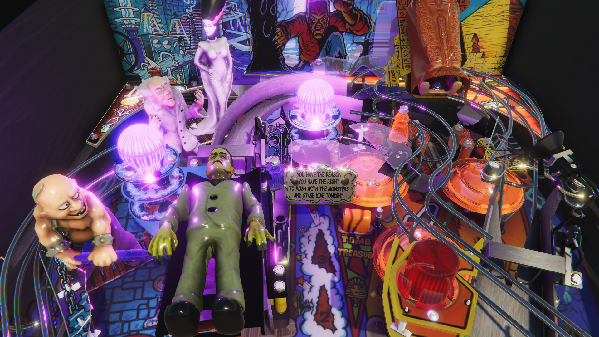

# Unity

[Unity](https://unity.com/) is one of the leading game engines. It has 
previously been dominating the mobile game segment, but in recent years
has caught up a lot in terms visual fidelity for high-end platforms.

Unity is free for non-commercial projects. VPE provides Unity support in a
separate DLL, called `VisualPinball.Unity`.

## Status

There are a few Unity-related features of VPE, and there will be (a lot) more
documentation. The main features VPE currently provides are:

- Import `.vpx` files into the Unity Editor
- Provide Visual Pinball specific features in the editor
- Export `.vpx` from the editor
- Nearly done porting VPX physics into Unity DOTS



It currently uses the built-in renderer, but will also be compatible with
Unity's [High Definition Render Pipeline](https://docs.unity3d.com/Packages/com.unity.render-pipelines.high-definition@7.1/manual/index.html)

### Usage

This repository acts as a Unity Package. That means you can import it into
your Unity project as a package. In order to do that:

1. Open Package Manager (*Window / Package Manager*)
2. Click on the "plus" button on the top left
3. Choose *Add package from disk*
4. Navigate where you cloned this repo and select `package.json`

You'll then have a *Visual Pinball* menu in the Unity editor where you can 
import `.vpx` files. You'll be also able to drag and drop `.vpx` files into 
your asset folder and Unity will create the table model directly.

*Note:* OSX users will need to add the following `dllmap` entries to the Unity `config` file
prior to launching Unity:

```
<configuration>
        <dllmap dll="libvips-42.dll" target="libvips.42.dylib" os="osx" />
        <dllmap dll="libglib-2.0-0.dll" target="libvips.42.dylib" os="osx" />
        <dllmap dll="libgobject-2.0-0.dll" target="libvips.42.dylib" os="osx" />
        .
        .
```

The `config` file is located at:

- `2019.4.1f1:` `/Applications/Unity/Hub/Editor/2019.4.1f1/Unity.app/Contents/MonoBleedingEdge/etc/mono/config`
- `2020.1.0b12:` `/Applications/Unity/Hub/Editor/2020.1.0b12/Unity.app/Contents/MonoBleedingEdge/etc/mono/config` 

## Future

Unity allows extending its editor. This allows us to use Unity as a table
editor and export the table back to `.vpx` files. While the Unity editor 
is not a modelling tool, it has excellent integration with existing tools like 
Blender, so would facilitate the workflow for table authors a lot.

Since the VPX file format acts like a virtual file system, it would be possible
to save additional assets such as custom materials or shaders to the `.vpx` 
file without breaking backwards compatibility.

This would allow table authors to provide tables that run in Visual Pinball and
at the same time make use of Unity's more advanced shaders.
